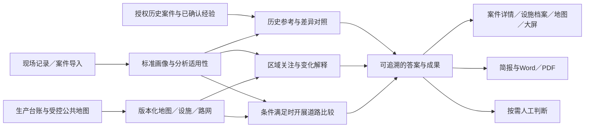

# AiCommander

### 涉油案件数智研判与防控辅助系统

让有限的现场记录，转化为有依据的历史参考、区域关注和工作材料。

AiCommander 面向油田保卫与涉油案件研判场景，将案件记录、生产台账、地图、历史经验和分析成果连接起来。员工只登记实际掌握的情况，系统按资料条件开展分析；不知道的内容保留未知，不要求为算法补齐侦查信息。

**当前源码版本：v9.5.0-stable** · [版本文件](VERSION) · [发布与迁移说明](docs/releases/v9.5.0-stable.md) · [验证记录](docs/validation/2026-10-09-v95-release.md)

> 源码 Stable 不等于 GitHub 已发布或现场已投产。真实内网模型、目标服务器、现场地图道路完整性和业务使用效果分别验收。仓库不包含真实案件、精确生产地图、模型权重或完整离线运行镜像。

## 解决什么问题

系统围绕三个日常问题工作：

- **这条记录有什么历史参考？** 在全部授权历史资料中查找共同条件和关键差异，说明哪些经验适用、哪些不能直接套用。
- **这片区域或这口井有哪些关注依据？** 分开展示明确关联、空间邻近、条件相似和生产背景，不把“附近有案件”直接等同于设施涉案。
- **最近发生了哪些实质变化？** 区分新发现、旧案补录、原记录更正和资料版本变化，不把录入数量增加直接解释成近期发案增加。

例如，一条“某时某地发现车辆装有疑似原油，已移交，来源不详”的记录，可以正常保存、查找历史参考并形成基础材料；发现地点不会自动变成盗取地点，来源未知也不会让员工反复处理“分析未完成”。

## 核心能力

| 能力 | 可以完成的工作 |
| --- | --- |
| 现场记录与案件治理 | 简要录入、Excel批量导入、私有草稿、编辑冲突保护、来源修订；区分发现与案发、已知与未知、本单位处置与已知反馈 |
| 历史参考与对照 | 联合结构条件、中文词项和可选本地语义检索；展示共同点、明确差异及两侧原文出处，每案最多三项参考 |
| 生产台账整理 | 保存字段映射与坐标模板，预览逐行差异，修正同类问题，失败行续做；记录完整/增量声明、覆盖范围和有效期 |
| 设施与区域研判 | 以稳定设施编号汇集台账、案件、事件、道路和已有成果；明确关联、邻近与候选分层，保留来源和版本 |
| 离线地图 | 受控地图包导入、验包、版本发布与回滚；本地底图、地名索引、字体和图标，兼容既有地图快照 |
| 道路条件比较 | 利用真实机动车路网、可信入口和通行条件比较候选；固定输入下比较最多三套条件，不以直线距离冒充道路距离 |
| 态势与专题 | 发现/查获、案发、录入三种时间口径，完整周期比较、补录与修订解释；持续专题、条件案组和最多三项关注建议 |
| 问题回答与材料 | 三类明确业务问题、必要的单项澄清、证据与信息缺口；页面、地图和Word/PDF复用同一成果快照 |

### 9.x：让日常工作少录一次、少整理一次

- 原始经过只写一次，字段候选只补空白，人工修改优先；服务端私有草稿自动暂存，刷新后可继续，提交凭证防止重复建案。
- 案件更新表按稳定来源键和源行身份持续导入；同键不重复，人工修改和来源冲突保留差异，不自动覆盖。
- 生产资料按实际文件推荐模板，支持选区粘贴、结构漂移分级、后台分块和整批采用；指定人员仅维护授权厂区，不必成为全站管理员。
- 可信冻结历史回答可按当时查看，当前权限仍需满足；规则入口和查询共用回答要点，不把工具成功当成问题已回答。
- 全部授权筛选明细可导出 Excel/CSV，支持白名单列及中文表头；已有材料按用途组合，同一版本用于页面与 Word/PDF，不重复分析。

单位正式样表、真实内网模型和员工实际节时效果分别待现场确认。复杂旧成果没有可靠冻结内容时继续严格失效，未经核验的投影坐标路径明确禁用。详见[数据权威与输出契约](docs/data-contracts-v9.zh-CN.md)。

已有的独立事件、关系图谱、经验卡、历史会议和报告继续保留。多模型会议是高级可选功能，经验沉淀、报告导出和人工判断均按需使用，不构成每条记录的必经流水线。

### 9.5：按实际保卫台账校准案件整理

- 案件导入选择“保卫案件年度台账”，保留重复备注、无表头补充列、原上传文件和物理行号；在案件来源中直接查看原始行。WPS `.et` 先另存为 `.xlsx`。
- 区分发现、案发、报送时间，以及涉油、查获、回收、移交等数量角色；年份冲突、单位不明、区间或约数保留待核，不自动填成精确事实。
- 在已有画像中分开展示现场发现、查获、回收、移交、检斤，不把处置环节当作作案手法；否定和未完成状态不变成已完成。
- 页面和 Word/PDF 的材料内容共用现场处置片段及原文引用；原件撤销后隐藏复制的原始行内容。

本版完成的是这类台账的导入—来源—规则画像—材料内容适配。人员车数等原始统计列目前仅保留来源，尚未新增对应全库统计指标；不据台账自动建立逐人逐车档案，不承诺无坐标案件的道路分析。真实样本仅在本地只读核对，不进入公开仓库或外部模型。

## 一条贯通的业务链



原始事实、派生分析和人工判断分层保存。后台处理不要求案件保存等待模型或道路计算；资料、规则和授权变化后，结果按版本更新，历史读取仍检查当前权限。

## 智能化如何工作

采用四项业务智能体能力——地理底座、案件治理、双域线索研判、态势部署参考——以及统一的确定性编排机制，不建设反复审核同一份资料的多Agent辩论网络。

- **规则负责事实与计算。** 权限过滤、数据查询、统计、空间与道路计算、条件排序由确定性服务执行。
- **模型提供可选增强。** 可信内网模型可增强语义提取、自然语言理解和表达；支持兼容协议，不绑定某一家供应商。
- **不配置模型也有明确用途。** 基础录入、规则整理、条件检索以及上述三个明确问题不要求模型密钥。任意自然语言问答不能据此宣称已经启用。
- **适用性先于任务执行。** 资料不足、不适用、服务不可用分别显示；仅有发现地点时，不据此推断盗取来源。
- **回答完成度独立判断。** “已回答、部分回答、资料不足、依赖服务不可用”不等同于工具是否执行成功。问题链累计最多8个工具步骤、120秒实际执行预算；等待澄清释放执行资源，24小时未回复失效。

日常智能查询由 `ENABLE_INTELLIGENT_QUERY` 独立控制；实验性 Agent Lab 默认关闭。开启业务查询不等于允许模型外发或正式数据写入。配置详见[可选能力与后台排程](docs/runtime-feature-switches.zh-CN.md)、[内网提取适配器](docs/local-case-extraction.zh-CN.md)和[本地语义检索](docs/local-history-embedding.zh-CN.md)。

## 离线地图与道路

地理底座面向大庆、齐齐哈尔两市公共地图与内网生产资料，显示地图和计算路网分别管理：

- 公共地图在联网侧制成受控更新包，精确生产资料在内网合并，不回传联网制包区。
- 内网服务器提供瓦片、样式、中文字体、图标和地名搜索；浏览器缓存仅用于加速，不作为离线保障。
- 道路计算复用 PostGIS 与 Valhalla，执行单行、转向、车型、封闭和内部通行限制；情景参数只能追加限制，不能绕过权限。
- 缺入口、缺路网、权限受限与服务故障分别提示。历史路况未知时，不宣称还原案发路线。
- 新版本失败保留上一有效地图。旧路网没有保留构图源包时，额外道路排除明确显示未具备条件，不伪造计算结果。

**离线是指服务器断公网、客户端仍通过内网访问服务器**，不是每台浏览器脱离服务器独立运行。地图包和道路资料须单独导入并完成现场核验；公开来源缺失不等于现实中没有道路或设施。

## 安全与业务边界

- 按用户、单位/辖区和授权范围读取资料，历史结果与导出也重新鉴权。
- 原始案情、人员信息和精确生产坐标留在内网；兼容模型API协议不代表获得外发授权。
- 原文中的指令只作为资料内容，不控制工具；业务接口不提供任意SQL、Shell、文件路径或外部网址执行。
- 原始案件事实不被Agent自动覆盖；明确陈述、否定、不确定、推断和信息缺失分开。
- 不自动认定嫌疑人、具体居住地、实际轨迹、囤油点或正式案件链条，不自动创建巡逻、调查、抓捕等执行任务。
- “已移交”不等于公安已办结；“未获反馈”不等于否；“台账未出现”不等于设施停用。
- 系统不替代案件事实核验和人的业务决定，也不把分析完成当作案件办结。

## 技术栈

| 层次 | 技术 |
| --- | --- |
| 前端 | React 18、TypeScript、Vite 8、Ant Design、TanStack Query、ECharts |
| 地图显示 | MapLibre、Leaflet、本地MBTiles及版本化地图资源 |
| 后端 | Python 3.12、FastAPI、SQLAlchemy、Alembic |
| 后台任务 | Celery、Redis 7、事务Outbox与持久化任务记录 |
| 生产数据库与检索 | PostgreSQL 16、PostGIS、pgvector；SQLite用于轻量开发与隔离测试 |
| 道路与交付 | Valhalla、Docker Compose、Nginx、配套文档渲染运行环境 |

## 本地开发

### 轻量启动

准备 Python 3.12、Node.js 24 和 npm，并确认本机3000、8000端口可用。以下命令在**独立开发副本**中执行，仅用于基础界面与录入开发，不是生产部署。

后端：

```bash
cd backend
python3.12 -m venv venv
source venv/bin/activate
python -m pip install -r requirements-dev.txt

ENVIRONMENT=development \
DATABASE_URL=sqlite:///./aicommander-dev.db \
SECRET_KEY=local-development-secret-key-change-me \
BOOTSTRAP_TOKEN=local-bootstrap-token \
AUTH_REQUIRED=true \
AUTO_CREATE_TABLES=true \
SESSION_COOKIE_SECURE=false \
ENABLE_API_DOCS=true \
ENABLE_AGENT_LAB=false \
AGENT_MODE=off \
AGENT_MUTATIONS_ENABLED=false \
ENABLE_INTELLIGENT_QUERY=false \
python -m uvicorn app.main:app --reload --host 127.0.0.1 --port 8000
```

另开终端启动前端：

```bash
cd frontend
npm ci
npm run dev -- --host 127.0.0.1
```

访问 [本地前端](http://localhost:3000)；开发API文档位于 [本地 /docs](http://localhost:8000/docs)。首次打开按页面创建管理员；本机直连开发模式支持本机初始化，如页面要求令牌则使用上面设置的开发令牌。密码至少12位，并满足页面的复杂度要求。随后在系统设置中确认厂区与账号范围。

上述密钥和令牌**仅为本机开发示例，不能用于部署或共享环境**。示例使用单独的 `aicommander-dev.db`；已有数据库不要通过删除、重新初始化或开发自动建表来升级。

### 完整功能的前提

轻量启动不会自动配置模型、下载地图或启动后台消费者：

- 自动画像、索引更新和周期任务需要 Redis、同版 Worker 与 Beat。
- 三类业务问题还需开启智能查询及其消费队列；可与实验 Lab 分开启用。
- 地图需要已验收并发布的本地资源；道路需要匹配版本的路网、入口及计算运行环境。
- 中文Word/PDF及地图导出需要配套渲染器、字体和运行依赖。

仓库保留 `start.sh`、`stop.sh` 和开发用 `docker-compose.yml`。当前开发Compose的默认数据库镜像与自动建表流程**不能作为完整新库一键可用的保证**：完整PostgreSQL环境须先具备PostGIS、pgvector并执行迁移。开发密码、源码挂载及热重载不能用于生产。

更多本地说明见 [QUICKSTART.md](QUICKSTART.md)，其中早期版本号和Docker章节属于历史说明，当前版本及启动前提以本页和发布说明为准。

## 内网部署与升级

先阅读 [v9.5发布、迁移与回退说明](docs/releases/v9.5.0-stable.md)，再按[内网启用与恢复主手册](docs/current-intranet-operations.zh-CN.md)准备交付。

1. 核定目标架构、首批开放能力、账号范围和数据来源。
2. 准备同版应用/Worker/前端镜像、双扩展数据库、地图与可选道路/模型/导出资源，形成经批准的离线交付清单。
3. 保全数据库、来源原件、地图、道路源包及配置；密钥分离保管。
4. 在隔离环境核对迁移与恢复，再执行本次批准的部署流程。内网采用 `DEPLOY_IMAGE_MODE=prebuilt`，不依赖现场下载。
5. 开放前核对登录权限、案件保存、后台消费、清缓存断公网地图、中文导出，以及本次启用的道路或模型能力。

当前迁移头为 `v94o01`；从v8.4升级为 `v80f01 → v91s01 → v94o01`，新增案件来源身份与输出配置表，不改写现有案件。非空新表禁止破坏性降级；不能仅替换旧程序访问新版库。回退使用独立相容备份，并保护升级后新增原始资料。保持 `ENABLE_LEGACY_OPERATIONS_MODULES=false`。

v7.5首次上线交付工作包继续在本地独立准备，不随本次源码发布；其固定版本镜像和现场确认不能自动视为v9.5交付。地图包和资料后台任务均需准备消费者：地图台账模块为 `app.tasks.map_ingest_tasks`、队列 `map_build`，沿用现有 Beat；上传文件不等于验包、采用或发布成功。

## 验证

开发期间按改动范围运行测试；收口时核对核心业务、权限、迁移和恢复。已有有效证据可复用，不因版本号变化重下载地图或重编路由依赖。

后端（从仓库根目录执行）：

```bash
cd backend
source venv/bin/activate
python -m pytest
```

前端（从仓库根目录另开终端）：

```bash
cd frontend
npm run test
npm run typecheck
npm run build
```

真实数据库、路由、地图及浏览器专项需要相应隔离环境；默认跳过的项目不能计为通过。测试命令不应指向业务数据库。

v9.5台账适配的针对性回归与验收边界见[发布验证记录](docs/validation/2026-10-09-v95-release.md)。v9.4的集中回归、浏览器贯通、原生数据库并发/备份恢复、Word/PDF及保存性能结果见[历史实施记录](docs/validation/2026-10-09-v9x-implementation.md)。地图源与路由引擎未变部分复用原有证据。本地合成结果不替代目标服务器容量、真实模型效果或员工实际收益。

## 项目结构

```text
AiCommander/
├── backend/
│   ├── app/
│   │   ├── api/             # 业务接口与权限入口
│   │   ├── services/        # 案件、资料、研判与材料服务
│   │   ├── repositories/   # 持久化与空间查询
│   │   ├── models/          # 原始资料、派生结果与运行记录
│   │   ├── agent_runtime/   # 受控运行、预算与事件轨迹
│   │   └── tasks/           # 后台任务与调度
│   ├── alembic/             # 增量迁移
│   └── tests/               # 后端验证
├── frontend/src/            # 页面、组件、接口与前端测试
├── deploy/                  # 运行镜像、离线交付与部署配置
├── scripts/                 # 构建、迁移、验包与验证工具
├── docs/                    # 使用说明、版本记录与设计文档
├── VERSION                  # 当前源码版本
├── docker-compose.yml       # 本地开发编排
└── docker-compose.production.yml
```

## 文档导航

| 需要了解 | 文档 |
| --- | --- |
| 当前功能、升级和回退 | [v9.5发布说明](docs/releases/v9.5.0-stable.md) |
| 本轮做了什么、哪些尚未验证 | [9.x实施记录](docs/validation/2026-10-09-v9x-implementation.md) |
| 9.x各工作包的目标与边界 | [9.x路线图](docs/superpowers/specs/2026-10-09-v9x-upgrade-roadmap.md) |
| 台账模板、差异预览与异常续做 | [生产台账整理指引](docs/map-ledger-quickstart.zh-CN.md) |
| 内网交付、启用与完整恢复 | [运维主手册](docs/current-intranet-operations.zh-CN.md) |
| 首次上线的人员与验收安排 | v7.5首次上线工作包另行交付，不包含在本次源码发布中 |
| 可选能力、消费者与旧入口兼容 | [运行开关](docs/runtime-feature-switches.zh-CN.md) · [业务兼容说明](docs/business-compatibility-migration.zh-CN.md) |
| 内网模型与语义检索 | [案件提取](docs/local-case-extraction.zh-CN.md) · [本地嵌入](docs/local-history-embedding.zh-CN.md) |
| 历史版本与专题资料 | [发布记录](docs/releases/) · [文档目录](docs/README.md) |

历史运行手册和旧版本验收保留作参考；有冲突时，以当前版本发布说明、实际配置与当前代码契约为准，不将过去的验证直接计入新环境。

## 开发约定

- 保持“涉油案件研判与防控辅助”的业务边界，不扩展为执法执行或通用管理平台。
- 新功能优先复用现有案件、地图、检索、专题和材料服务，保留旧记录及稳定入口。
- 涉及权限、数据迁移、道路限制或出域行为时，补充对应成功与失败验证；项目细则见 [AGENTS.md](AGENTS.md)。
- 不将真实案件、人员信息、生产坐标、密钥、内部文件或模型权重提交到仓库。`docs/submission-materials/` 为本地私有材料目录，不随源码发布。

**系统的价值不是推断得更多，而是在有限资料下，明确告诉使用者：有什么依据、有什么差异、还有什么不能判断。**
