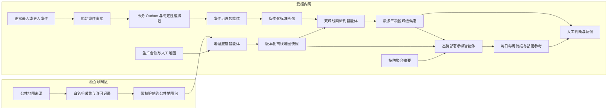

# v3.6 四个业务智能体与确定性编排器

生产精确数据不流向联网区。四个智能体是四组受控业务能力，不是互相反复审核的聊天角色；编排器只处理触发、租约、幂等、重试、权限和版本。

| 数据层 | 自动能力 | 人工边界 |
| --- | --- | --- |
| 原始事实 | 只读分析，不覆盖案件原文 | 用户负责正式录入和修正 |
| 标准分析 | 生成案件画像、标准地图层和地图快照 | 管理员处理首次模板和异常冲突 |
| 研判成果 | 生成有来源的区域候选、简报与部署参考 | 判断有用、无用或信息不足；不自动转为结论或执行任务 |

每个成果绑定案件画像、地图快照、算法和范围策略版本。模型只是可选的语言整理环节，不创造事实或改变确定性评分；没有证据时明确返回信息缺口。

故障隔离：地图新版本失败保留旧版；模型失败使用规则；Redis/Worker 中断保留 Outbox；关闭旧 Agent Lab 不影响案件、地图和报告核心链路。
