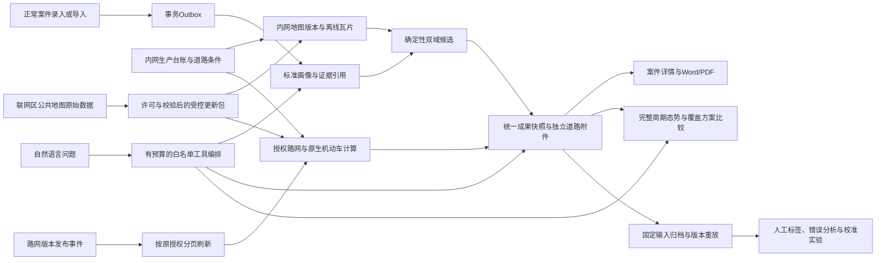

# 4.x 收口架构与数据边界

对应当前候选实现；发布与验收状态见[收口核对](../validation/v4.5-closeout-audit.md)。

## 职责分工

- 地理底座负责来源、坐标、离线显示、路网和通行条件。显示瓦片不能代替可计算道路数据。
- 案件治理负责标准画像、明述/否定/不确定信息与原文出处，保存案件不等待模型或路由。
- 双域研判负责已有证据上的候选解释，道路距离由原生计算提供，不用直线距离冒充。
- 态势参谋负责同范围等长周期及空间方案比较，没有明显变化或证据不足时可以不出建议。
- 编排器只管理任务、授权、限步、超时、幂等、取消、重试与版本，不参与自由业务推理。

## 三层数据

1. 原始事实：案件原文、生产台账与来源记录，智能能力不自动覆盖。
2. 派生分析：画像、地图/路网版本、候选、道路成果和比较快照，可由受控后台生成。
3. 人工决定：标签、采纳反馈与正式业务判断；候选不自动成为案件事实或执行任务。

## 可信边界

公共数据采集区不接收案件、精确生产坐标或技防位置。内网模型与外部模型的信任配置独立，
兼容某种API协议不代表允许发送原始案情。未配置模型时工具与核心业务可继续运行。

查询及历史成果每次读取均核验当前权限。后台道路任务保留案件原发起人的授权上限，
路网发布管理员的权限不会转借给案件重算。封闭道路、未知门禁与未经许可的内部道路
不能通过调高成本伪装成“可通行”。历史结果必须说明所用版本，不声称还原未知历史路况。

## 可解释性与失败行为

每项候选展示证据、反向证据或缺项、规则支持度及适用边界；支持度不是校准后的准确概率。
固定输入重放不重新读取今天的数据填补历史空白；失败、空结果及无标签分别记录。
校准采用案件分组的训练/验证隔离和基线对照，实验结果不自动替换生产算法。

队列或模型故障不阻止案件保存；地图构建失败保留上一有效版本；路由失败明确不可用。
运行恢复依靠持久事件、提交令牌和幂等键，不要求普通用户反复选择案件和地图资源。
当前刷新缺少可靠拓扑差异时，保守检查整张适用图，而不是只查旧路径经过的道路。

## 竞赛表达

展示真实业务服务及其版本轨迹。合成数据、实时运行、历史回放和故障注入分别标明。
不展示自动认定嫌疑人、具体居住地、实际行驶轨迹或自动巡逻/调查/抓捕指令。
真实效果持续收集；没有现场证据时不宣称准确率、节时或防控效果已经提升。
