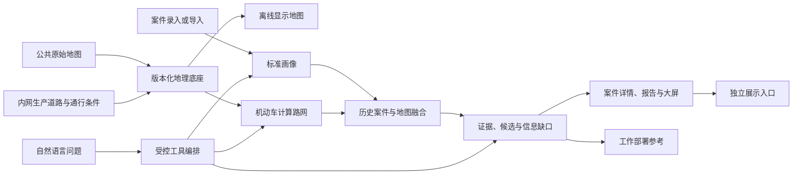

# AiCommander 4.x 大版本升级路线图

日期：2026-09-10。状态：用户已批准，分版本实施中。升级基线：`v3.6.0-stable`。

本文件覆盖 `v4.0.0-stable` 至 `v4.5.0-stable`，不代表这些版本已经实现或发布。
实施进度与证据见 [v4.0 实施清单](../plans/2026-09-10-v4.0-implementation.md)。
本规格取代历史大屏方案中“从已加载样本推算总体”“多个列表默认自动轮播”等要求。

持续目标已确认为按此顺序推进至 `v4.5.0-stable`；当前为v4.5最终发布分支，
发布状态与剩余事项见[收口核对](../../validation/v4.5-closeout-audit.md)。
不能将完成首版当作完成系列，也不能将后续版本能力全部提前作为首版门槛。

## 1. 目标、架构与边界

优先级：可用性 → 实用性 → 智能化 → 真实竞赛展示。继续四项业务智能体能力和确定性编排器，
不新增质疑、复核或多智能体辩论网络。编排器负责事件、权限、版本、预算、重试和取消；
模型只在白名单内理解问题、选择工具和整理语言；业务服务负责事实查询、统计、空间计算及评分。

- 原始案件不被 Agent 自动覆盖；派生画像、候选、建议及报告独立存储。
- 不自动认定嫌疑人、实际行驶轨迹、具体居住地、囤油点或正式串并案关系。
- 不自动生成正式巡逻、调查、抓捕或处置任务，不扩成通用执行管理平台。
- 普通用户正常录入一次，不负责挑选案件、井点、分析半径或管理 Agent。
- 地图覆盖大庆、齐齐哈尔全域。公开数据缺失不等于现实中没有道路或设施。
- 内网服务器可以完全断公网，客户端通过内网访问；不要求浏览器脱离服务器独立工作。
- 机动车分析不包含步行、无路地带穿越、实时导航或交通预测。
- 厂内道路资料暂不完整，逐步补齐；未知入口不自动猜测。
- 公共道路合理跨辖区绕行允许；业务数据可见范围、道路通行许可与行政边界分别处理。
- 用户问题、原文和精确生产坐标受出域限制；兼容 OpenAI 协议不等于允许原始数据出域。

## 2. 六个独立发布版本

| 版本 | 交付重点 |
| --- | --- |
| v4.0.0-stable | 大屏、全域离线地图、可靠导入搜索、基础智能查询、展示入口 |
| v4.1.0-stable | 案件语义画像、统一成果、Word/PDF、内部道路与入口治理 |
| v4.2.0-stable | 机动车拓扑、通行约束、参考路径、沿路可达性 |
| v4.3.0-stable | 多条件专题研判、连续追问、自动补查、证据报告 |
| v4.4.0-stable | 真实态势变化、技防缺口、空间覆盖方案比较 |
| v4.5.0-stable | 冻结输入评测、反馈校准、性能运维、生产及竞赛收口 |

### v4.0：日常可用底座

实施顺序：统计与导入修复 → 离线地图及原始路网 → 基础智能查询 → 大屏与展示 → 集成验收。

**日常大屏**

- 四项指标：本期案件、同长度上期变化、授权范围登记井、本期研判成果。
- 后端聚合完整授权数据；范围、周期、截止时刻与指标口径明确，不拿首屏样本当总体。
- 一张主地图、一组趋势、最多三项重点；点击重点联动案件和证据。
- 缺坐标案件纳入统计，编辑、删除、补录后刷新；零值、加载、故障、过期分别展示。
- 更新不重置地图视角；首次进入、切换范围和手动复位才重新定位。
- 1920×1080 主设计、核心正文至少 18px，兼容 4K 与办公屏，小屏重新排版。
- 保持深色风格，减少装饰动画和默认自动滚动。

**两市全域精细离线地图**

- 原始公共地图 → 矢量 MBTiles → MapLibre + 本地地名索引。
- 来源已有道路、村屯、建筑、水系、桥梁、行政边界完整保留；原生级别 6—16，显示至 19。
- 中文字体、样式、图标、搜索及依赖内网化；案件、辖区、态势、大屏共用加载能力。
- 公共图层与生产图层分离，保留历史栅格地图及快照读取。
- 分片、断点续传、后台验包、完整包集校验、原子发布及回滚；失败沿用上一有效版本。
- 联网侧每月检查公共更新，内网更新时间取决于受控交换；精确生产数据不进入联网区。
- 下载获准的原始数据，不批量抓取 OSM 公共标准瓦片。

**路网前置条件**

- 保留 PBF 原始对象、节点顺序、标签、限制关系和稳定源编号，不从显示瓦片反建拓扑。
- 道路节点与转向限制引用完整校验；保留外围必要公共道路。
- 真实片区验证单行、禁转、立交分层、边界接续。
- 地图覆盖、道路连接覆盖、通行属性完整度分别报告。

版本归属澄清：源数据异常必须保留来源、质量标识和影响清单，引用缺失不可隐瞒；
v4.0不开放机动车业务路由。全域通行条件、异常路口硬排除、权限有效图及路线/矩阵/可达范围
一致执行属于v4.2验收，不提前要求v4.0将整个公共源认证为可通行网络。
v4.0仍必须完成上述真实片区构图验证，不以仅存储原文件代替。

**高频案件操作**

- 服务端分页、全授权库搜索筛选、独立按 ID 打开案件。
- 中文表头、工作表选择、字段模板；批次回执、行级失败与仅重试失败行。
- 导入幂等；复用保存前缺项提示和后台画像，不新增普通用户必需操作。

**基础智能查询和展示**

- 复用模型注册表，支持 OpenAI 协议兼容 API 和内网模型。
- 仅案件查找、地点设施查找、条件统计、周期比较、已有成果汇总五类工具。
- 模型可选工具与顺序，不提供任意 SQL、Shell、外部 URL 或文件路径执行。
- `/showcase` 菜单名“展示”，认证访问、隔离脱敏数据、复用业务服务。
- 展示案件导入、已有画像、关联证据、简报和降级；实时与历史回放明确区分。

验收：统计一致、全库搜索与重试正确、阻断公网并清缓存后各地图可用、构图验证通过、
智能结果与业务查询一致。尚未实现的能力不得用入口、模拟结果或版本号代替验收。

### v4.1：案件理解、统一成果与内部道路治理

- 内网提取时间、地点条件、手法、设施、油品、工具、车辆、来源去向及上下游线索。
- 每项关联原文位置；区分明确陈述、否定、推断、矛盾和缺失；模糊地点不自动变成精确坐标。
- 原文使用内网模型/本地抽取，外部模型只接收受控脱敏特征。相关数据未变化不重算。
- 案件、分析页和报告中心共用成果对象：事实、关联条件、候选、支持/反向证据、缺口、边界及版本。
- Word/PDF 与页面及地图一致，历史成果兼容保留。
- 专用道路导入支持完整线形、多段道路、稳定编号、入口、单行、车型、门禁、有效期和来源。
- 不沿用同名点位合并；内部已核验修正不会被公共更新覆盖。
- 厂内道路分区域补齐；无连接或未知入口待核，不增加案件录入必填项。

验收：同义关联、否定不误提、原文版本可追溯、导出一致、同名路段不误合并、缺入口不穿墙跨河。

### v4.2：机动车真实道路融合研判

- PostGIS 管理道路及条件，Valhalla 在内网计算；不并行维护两套路由引擎。
- 输出沿路距离、绕行程度、参考路径、多候选可达性、时间/距离预算可达道路及有意义备选通道。
- 直线只粗筛。车型和时间来自画像，未知参数明确列假设；耗时不是准确 ETA。
- 已关闭、无通行许可的内部道路及未知门禁在计算前排除，不用 penalty 代替禁止。
- 按权限组和条件版本形成有效图，过期条件不继续声称可通行。
- 引擎仅后端访问；禁止用户/模型传忽略限制参数；路线、矩阵、可达范围执行同一规则。
- 合理公共绕行不开放其他辖区内部数据；缺井场入口只到可信入口或公共路附近并显示连接待核。
- 历史案件使用适用版本；无当时路况则明确无法还原。
- 结果绑定画像、地图、路网、条件、车型假设、时刻及算法版本。

验收：单行、禁转、桥隧、限高限重、门禁、封路、边界、权限均通过；路由故障不以直线冒充道路。

### v4.3：可追问专题研判助手

- 多条件组合、连续追问和按需补查，复用案件、统计、路网及成果服务。
- 工具结果驱动补查或停止，不把固定执行配方包装成动态规划。
- 追问继承明确范围、时间、版本；条件变化清晰提示，不扩大权限。
- 输出事实、推断、建议、缺口；不足时返回部分结果，不强行形成结论。
- 交互默认最多 8 步、120 秒、可取消；大任务后台运行且显示进度。

验收：不同问题轨迹合理不同、追问不丢条件、不越权、计算一致、模型不新增事实或证据。

### v4.4：态势变化与部署参考

- 每日/每周同范围、同长度周期比较案件类型、地点手法油品、设施关联、道路入口及技防变化。
- 案件按案发时间、成果按生成时间分别统计；无明显变化不强行建议。
- 每期最多 3 项关注建议，包含区域、时间、设施、依据、资源假设、缺口、有效期；不生成执行任务。
- 覆盖比较从真实位置、覆盖范围、路网、时间和资源计算，区分未覆盖/重叠/覆盖。
- 不用手填比例乘支持度模拟；缺视场/遮挡资料仅称名义覆盖，不能声称证明防控效果。
- 技防仅接位置、状态、覆盖摘要、时间窗事件量；原始视频、抓拍和完整车牌不送模型。

验收：位置、封路、资源变化可解释；重叠不重复计数；无资料不虚构方案或效果。

### v4.5：评测、性能与交付收口

- 不增业务 Agent。冻结输入评测、反馈归集、校准错误分析、性能优化、版本追踪及恢复演练。
- 冻结案件特征、地图、路网、条件、标签、算法配置；源案件修改不改变旧评测重放。
- 无标注不充当正确；失败和空结果进入分母；未校准分数称规则支持度而非准确概率。
- 增量计算考虑既有路径和受影响连接区域，新道路捷径不能仅靠旧路径引用失效。
- 完成竞赛展示、部署文档及管理员运行中心。

验收：输入重放、退步检测、权限变更缓存失效、故障恢复、连续五次完整展示、高优先级阻断清零。

## 3. 接口和兼容

扩展现有服务，不重复建设案件、地图、报告系统：大屏汇总；schema 2 地图 manifest；
导入批次/模板；画像原文和路网证据；查询任务/取消/轨迹；路径/矩阵/可达范围；统一导出与反馈。

新增数据按地图包集、道路入口、通行条件、路网版本、查询任务和成果快照分组。
复用已有画像、事件、反馈和评测模型。自首版记录来源与版本，缓存包含权限和数据/规则版本。
历史成果读取仍检查当前权限。增量迁移保留兼容读取，不直接让旧应用读取不兼容新库。

## 4. 验收、发布与恢复

- 核心回归、权限隔离、敏感外发、原始事实不被 Agent 修改为硬门槛。
- 地图/路由/模型故障不阻断录入；关闭智能能力核心可用。
- 断公网并清缓存，离线地图可首次打开。
- 缺失、未连接、无权限、计算失败分别表达，不包装成正常或确定不可达。
- 2026-09-10用户调整：源码Stable先完成能力验证，可由当前会话模型接收真实提示词并桥接选择工具；实际内网模型配置、协议联通和现场端到端验证移至部署阶段，不阻塞源码Stable。桥接或模拟测试不得标为已完成部署模型联通；原始数据出域限制不变，桥接只使用隔离合成数据。
- 每版相关回归、迁移、隔离部署、备份恢复和完整用户流程有证据。
- 固定规模和环境记录性能：保存 P95 相对基线下降不超过 5%，常用地图冷启动目标不超过 5 秒。
- 30 天试用、固定真实样本数、全厂资料齐备、目标服务器现场确认不重新作为源码 Stable 门禁。
- 未完成的现场/道路/模型验证须标明，不计入已完成能力。
- 每个 v4.x.0-stable 通过后统一 GitHub 更新；普通改动不建 Release，仅阻断/高危安全问题 hotfix。
- 保留上一 Stable 恢复点及 v3.6 系列基线；回退使用兼容备份并保护升级后的新增原始数据。

## 5. 最终交付和依据

清晰大屏；两市断公网地图搜索和机动车路由；一次案件录入形成画像；道路约束影响候选；
自然语言追问及证据报告；每日每周建议和条件化覆盖比较；真实工具轨迹、输入变化和降级展示。

- [OSM 瓦片政策](https://operations.osmfoundation.org/policies/tiles/)
- [Osmium 原始路网提取](https://docs.osmcode.org/osmium/latest/osmium-extract.html)
- [Valhalla 路由接口](https://valhalla.github.io/valhalla/api/route/api-reference/)
