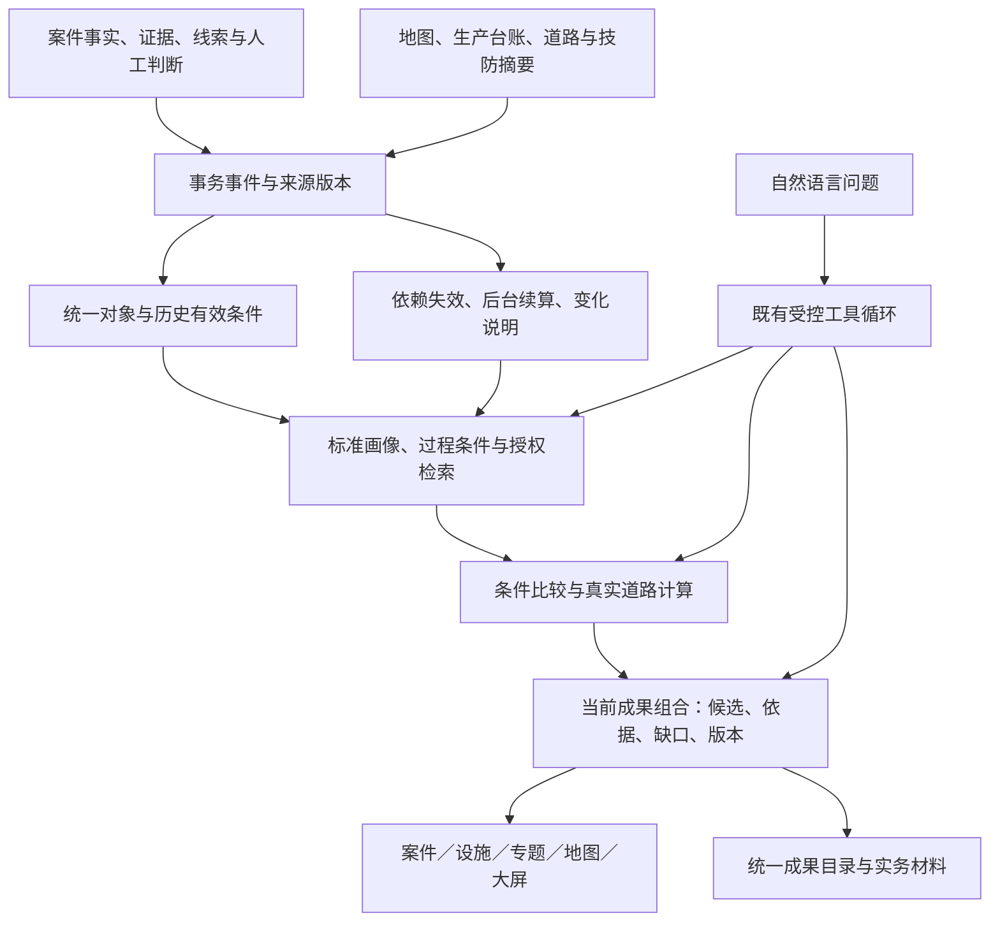

# AiCommander 6.x 详细升级路线图

## 从 v5.4.0-stable 到 v6.5.0-stable

编制日期：2026-09-27。更新状态：**v6.0 已按本轮授权完成本地源码收口；v6.1—v6.5 仍为待实施规划。源码版本不等于 GitHub 发布或目标服务器部署。**

> 2026-09-30 更新：上句及下方版本划分为初始规划时的历史状态。用户随后采纳的 [未投产重构路线](2026-09-27-predeployment-refactor-review.md) 已调整 v6.1—v6.5 的交付范围，并推进至 v6.5 本地功能收口；当前实现及发布状态见 [v6.5 说明](../../releases/v6.5.0-stable.md)和[综合验证](../../validation/2026-09-30-v65-implementation.md)。本文件保留作对照，不作为另一套必须重做的计划。

本方案用于整个 6.x 系列，不是一次性实施所有功能。作为后续规划依据，它替代 2026-09-25 的 v6.0—v6.4 草案；旧文件保留供比较。最初规划轮只新增审查文档；其后用户授权“推进到6.0版本”，实施范围与验证见 [v6.0 验证记录](../../validation/2026-09-27-v60-implementation.md)。

实施前基线：`VERSION` 与 README 均为 `5.4.0-stable`；Git HEAD 为 `56e63e4`，工作区另有未提交修复。**该轮基线是“该提交＋经核定的修复工作包”，不能把所有工作区文件直接当作已发布基线。** 当前源码版本已同步至 `6.0.0-stable`，本轮未提交或推送；用户原有演示、文档改动仍独立保留。

详细证据见 [全项目业务链审查](../../validation/2026-09-27-v6-business-chain-audit.md)，问题编号 A01—A14 在下文引用。

## 一、总体判断与目标

系统不缺页面和基础能力，当前最需要解决的是：

1. 同一案件存在旧即时画像、标准画像和多套聚合请求。
2. 主冻结候选与道路排序分别发布，部分页面仍使用旧邻近风险算法。
3. 线索、人工确认和来源更新没有完全贯通，补录资料未必影响该影响的结果。
4. 全库能力已经有了，但部分交互依赖逐案扫描，规模增大后成本会上升。
5. 成果可以导出，却分散在不同业务入口，用户仍要记住在哪里生成。

**6.x 的目标：一份原始资料只维护一次，一套当前分析供各页面使用，新增依据能解释性地改变结果，最终直接形成可用材料。**

优先顺序不变：可用性 → 实用性 → 智能化 → 真实竞赛展示。用户正常录入、查看依据、判断候选即可，不选择大批资源、不管理 Agent、不被要求每案出经验卡和报告。

### 为什么比旧草案多一个发布节点

旧草案先做设施身份与历史条件。现经当前消费者审查，发现主成果、经验确认及旧评分仍有并行口径，必须先处理，否则新增智能只会扩大不一致。

因此增加 **v6.0 主链归一**，后续业务深化顺延，最终为六个节点。不是另加一轮基础框架工程；v6.0 就要让日常案件页面更快、更清楚，确认一次对应准确的一份内容。

## 二、最终业务架构

采用现有后端内的模块化改造，不拆微服务、不换数据库/路由引擎、不增加智能体数量。

### 四层数据不混用

| 层次 | 内容 | 写入与使用规则 |
|---|---|---|
| 原始来源 | 案件记录、证据、台账、独立事件、未核实线索 | 保留原文、出处、核实状态；Agent 不自动覆盖 |
| 派生条件 | 画像、对象对应、过程片段、索引与道路条件 | 可自动生成；绑定来源和规则；并非正式事实 |
| 分析成果 | 候选、参考路径、条件对照、专题与简报 | 不可变版本；明确未知、反向依据及计算范围 |
| 人工决定 | 确认、驳回、备注、正式关系与报告审核 | 绑定具体对象与版本；后台不得继承到新内容或静默覆盖 |

四项既有业务智能体能力继续保留：地理治理、案件治理、双域研判、态势参谋。确定性编排负责权限、触发、预算与版本；模型只负责受控理解、工具选择和表达。前端不会增加四个必须逐个点击的 Agent 页面。

## 三、发布节点

| 版本 | 定位 | 用户能直接感受到的结果 | 主要审查依据 |
|---|---|---|---|
| **v6.0.0-stable** | 主链与成果归一 | 同一案件一套当前结果，旧分数不再干扰，确认状态一致 | A01—A07、A14 |
| **v6.1.0-stable** | 业务对象与历史条件 | 同井跨台账可对应，历史案件使用适用资料，长期案件检索更稳定 | A08、A10 |
| **v6.2.0-stable** | 案件过程理解与贯通助手 | 理解有出处的过程，回答具体业务问题，自动补查已有资料 | A09、A11 |
| **v6.3.0-stable** | 条件与真实道路研判 | 来源/转移候选由生产、时间、入口和道路共同支持 | A02 深化、A08—A11 |
| **v6.4.0-stable** | 变化续算与规模化使用 | 补一条资料知道哪些结果变了，避免反复全库计算 | A04、A05、A10、A12 |
| **v6.5.0-stable** | 实务材料与区域关注 | 案件、井场、专题、周期材料同源，直接用于日常工作 | A07、A11、A13 |

不强定发布日期；每版独立可部署，完成自身门槛才称 Stable。反馈、验证、恢复与展示随各版进行，不再独占一个“包装交付”版本。

## 四、逐版本实施方案

### v6.0：先把日常业务主链统一

**定位：修复当前业务分叉，不增加新的研判算法。**

#### 6.0-A：统一案件读取与画像来源

- 日常案件页以已有 `GET /api/cases/{id}/workspace` 为组合读取契约，模块可独立加载，但共享来源版本。
- 原始记录、必要缺项、当前标准画像、历史参考、候选及成果分别显示状态；“画像完成”不再泛称全部研判完成。
- 去掉日常打开页面时重复的完整 workbench、模型上下文、经验卡生成与历史搜索。普通 GET 只读取或轻量聚合，不调用模型、路由或原文重新抽取。
- `profile`、`processing-card`、`automation-workbench` 旧接口转兼容适配；旧 `features.summary` 没有可靠来源版本时标为历史，不混入当前摘要。
- 管理员预处理重建转入统一管线；历史输出可读，不另造一套持续运行的预处理器。

**涉及模块：** `Cases.tsx`、`case_workspace_service`、`case_profile_service`、`case_processing_card_service`、`case_automation_service`、`preprocess_service`。

#### 6.0-B：统一当前成果的选择与发布

- 扩展 `CaseResultSnapshot` 的组合契约，引用画像、条件候选、当前有效道路设施结果、资料缺口及各自版本。
- 复用 v5.2 已有道路候选，不另算一套；旧 v3.4 空间结果只作为明确标注的历史/基础参照。
- 初期没有道路结果时可以发布“画像已就绪、道路待处理”的部分成果，不能把直线候选伪装成道路结论。
- 道路完成后发布一个新的组合版本，页面、报告和助手同读此版本；旧组合不修改。
- “当前”限定在相同授权范围、用途、时间/车型假设和来源版本内。不同道路许可或资料权限的结果不能共用一个全局 latest；不得把管理员的更大范围成果作为普通用户的默认答案。结果不可交付时返回受限/待生成，不借换来源绕过鉴权。
- 组合采用无环引用：基础成果 → 道路附件 → 新组合成果。附件仍绑定原基础输入，新组合核验来源相容，不反向重写附件或制造循环。
- 基础成果生成、道路完成、组合发布使用不同事件类型；组合发布不得再次触发同输入道路任务。组合幂等键绑定来源与附件集合、条件及授权版本，过期任务不能把当前指针切回旧输入。
- 仅有村屯邻近、没有案件/经验线索时，不再新生成囤储候选；新的复杂研判等到 v6.3，当前错误口径立即收敛。

**涉及模块：** `case_result_service/snapshot/access`、`case_insight_service`、`case_road_artifact_service`、`CaseRoadComparison`、报告和查询读取适配。

#### 6.0-C：统一人工确认对象、变更事件和统计口径

- 经验状态解析优先识别具体 `KnowledgeAsset` 版本；旧 JSON 卡作为历史来源，不能将其确认复制给另一份内容。
- 处理卡、待办、画像和经验页共用状态解析器；确认哪一版，消除对应待办，不以新预览待确认重新制造旧待办。
- 旧卡迁为历史资产需保留原内容、审核人/时间/意见与来源 ID；不能确定是否同内容时保留两份并标兼容，不猜测去重。
- 将有关联案件的线索变更纳入来源版本与事务 Outbox；未核实线索仍只提供候选依据。人工标签保留独立解释层，不把全部 features 放回原文分析。
- 旧链条同步扫描移入后台，推断绑定双方源版本。源数据变化立即标旧候选过期；人工确认记录不删除，只提示其依据变化。
- 停止辖区旧风险分和条件组旧“综合风险”新增输出；历史记录与深链接保留。辖区管理回归数据维护，条件组逐步成为专题视图。
- 报告/事件统计由后端返回去重口径、范围、截止时刻和完整度；故障不得回退成零或列表长度。

#### 6.0-D：日常助手与实验运行分离

- 分开“允许新查询”“历史读取”“取消在途任务”和“实验 Agent Lab”能力开关，默认遵循原系统禁用状态，不因升级自动接通模型。
- 停止新查询不应让已授权历史消失；在途任务可取消，过期清理继续。切换规则需覆盖 API、Worker、Beat 和前端入口。
- 运行中心区分确定性业务处理、模型查询与实验任务；不把降级完成等同于模型成功。

#### 实施顺序与门槛

顺序：冻结消费者/响应基线 → 来源与状态适配器 → 组合成果契约 → 页面与旧接口迁移 → 同步扫描后台化 → 本版集成验证。

- 打开案件不重抽原文、不生成经验卡、不启动道路计算；无业务写入。
- 案件页、地图、设施、报告和助手对同一组合 ID 使用同一候选来源；等待道路明确显示等待。
- 同输入重复道路完成通知不产生重复组合或任务循环；不同授权/通行条件不共享错误的当前指针，迟到结果不覆盖新输入。
- 改时间/坐标后旧推断不再显示为当前；已确认关系和历史报告完整保留。
- 新经验确认只影响对应版本；不把报告/经验卡缺失作为案件未办结。
- 清单分页不改变总体，重复案件不被算成不同案件；故障、空、加载分别显示。
- 案件保存 P95 相对冻结基线退化不超过 5%，不等待模型、路由或旧链条全扫描。

### v6.1：统一业务对象与历史有效条件

**定位：回答“到底是哪个对象、当时适用什么资料”，同时让历史检索具备规模化基础。**

#### 升级功能

1. **同井多源对应。** 生产台账、人工点位、批准 GIS 可对应一个稳定设施；来源编号、别名、坐标和冲突全部保留。同名/相近只提出待核对应，可靠唯一编号或已批准映射可以自动复用。
2. **案件设施角色。** 区分案发地、查获地、被损设施、原文提及、来源候选及人工明确关联；不再要求为关联设施额外创建一条事件。
3. **双时间资料。** 区分业务有效时间与系统记录时间。支持“按现有完整资料回看某日”和“某日系统当时已知什么”两种查询；更新时间不自动等于生产生效时间。
4. **导入差异。** 返回新增、属性变更、冲突、显式失效和未变；本次台账未出现不视为删除/停产。变化事件包含来源版本和业务含义，不直接覆盖公共/人工核验资料。
5. **历史检索改为索引召回。** 复用 PostgreSQL/pgvector，授权及明确硬条件统一过滤，结构、词项与本地向量分别召回，取并集后融合排序和加载证据。不能把词项命中作为向量召回的前提，纯语义同义案例仍可进入候选。缺索引后台补齐，不在交互请求扫描并提取全库原文。
6. **完整查询可续跑。** 交互预算不足显示部分及完成范围；需要完整统计时转后台冻结查询，不以扫描到的前段 ID 冒充全库最优匹配。

#### 如何做

- 扩展 `JurisdictionAsset/MapFeatureClaim/MapFeatureVersion`，按需要增加轻量来源身份映射；不再建资产主库，不删除旧 ID。
- 映射自身版本化、可撤销，跨范围读取按每条来源鉴权；无权来源的摘要、别名、数量都不泄露。
- 有效期不明标为未知，交叠或编号复用进入管理员异常清单；普通用户不承担逐条匹配责任。
- 历史条件解析服务共供案件、设施、道路及专题使用，禁止各模块自行取“最新一条”代替案发时值。
- 索引保存规则、嵌入、源版本与状态；候选集读取再校验当前权限及源版本。初期继续精确向量路径，不为了技术展示另加向量库或更换检索框架。

#### 验收场景

- 同井异名多台账能汇集；同名异井不误合；撤销映射后旧报告仍能解释当时采用的对应。
- 历史补录、生产有效期交叠、缺历史值、编号复用分别有明确结果。
- 高/低 ID、旧/新案件均有固定检索场景，召回不再由顺序扫描决定；删除、撤权、改原文使旧索引失效。
- 零词项重合但有语义关联的对照案例仍能进入语义分支；优化不能退化为词项硬前筛。
- 没有索引与没有匹配分开；完整度不明不输出总体统计。

### v6.2：案件过程理解与贯通式研判助手

**定位：从“命中了哪些词”升级到“原文记载了什么过程、哪些问题可以用已有资料回答”。**

#### 升级功能

1. 在现有事件片段上表达时间区间、行为、设施/地点角色、油品、车辆描述、来源去向、明确先后关系；关系本身也要有原文出处。
2. 区分原文明确陈述、否定、推测、冲突、缺失和模型提取候选；不得把有引用等同于内容已核实。
3. 对模糊时间保留区间/参照条件，对模糊地点保留候选；不强制生成精确坐标、实际轨迹或具体住址。
4. 将过程条件供历史比较、专题和后续道路研判复用，不让模型抽取只停留在报告附段。
5. 助手接入设施档案、对象对应、历史条件、过程证据和成果状态；可按缺口向既有后台提交受控派生计算，再读取任务结果。
6. 明确两种模式：“解释这份冻结成果”固定引用版本；“按当前资料补查”生成新结果并标明变化。追问不能静默混用。
7. 专题支持版本化条件修订、固定/滚动窗口。修改条件生成新修订版，旧快照和引用不变；不能等价表达的条件继续拒绝保存。

#### 如何做

- 扩展现有画像 schema，不再创建一套“智能案件表”。本地规则为基本能力，内网模型为可替换提取器。
- 采用有限业务动作/角色集合与原文指针；校验引用、结构、时序和指代约束。校验通过只表示可计算的派生条件，不表示正式事实。
- 明确哪些条件可用于召回、哪些只能提示、哪些必须由人工确认；不新增逐字段必审流程，未知可以保持未知。
- 扩展既有 `intelligent_query_tools/loop/context`，保留 8 步/120 秒、取消、工具白名单和授权继承；新计算只能写派生任务，不能写案件、确认关系或派发执法任务。
- 相同输入和有效版本先复用成果；若请求新资料，复核权限与时效后再读，不以旧会话摘要替代当前证据。
- 规则模式不伪装“模型已理解”：前端分别显示规则整理、内网模型提取和未启用状态。

#### 验收场景

- 一段“先装载后转移”的明确原文能给出带引用的顺序；主体不明、先后矛盾、否定和假设不能拼成完整过程。
- 同义表述能形成可比较条件，但相似案件不成为当前案件事实。
- 不同问题有合理不同工具轨迹；缺资料时补查或停止，重复问题不重复创建相同后台任务。
- 专题改条件/滚动周期均有新版本；追问不能扩大权限或丢掉原筛选。
- 正式启用模型能力前必须验证实际系统配置的内网模型；开发模拟与当前聊天模型不能替代。未配置不阻塞确定性功能，但对应模型能力列为未启用。

### v6.3：有证据约束的生产条件与道路过程研判

**定位：回答“哪些设施或过程候选在已知条件下更有依据”，而非“哪个点最近”。**

#### 升级功能

1. **来源候选。** 结合案发时有效的生产属性、油品、测量条件、用途、可信入口、车型和通行限制比较；未知不记为不匹配，弱匹配不替代硬限制。
2. **入口治理。** 为地图管理员提供重点区域入口批量对应、可信来源、连通核验与异常清单。资料不足不阻塞普通案件保存。
3. **可解释召回。** 将现有 50 公里/100 设施等硬编码预算改成有上限的版本化策略；按授权范围和业务条件分批，显示扫描/可计算/未完成范围。不能通过放宽权限扩大候选。
4. **有限过程段。** 只有已有来源、案件或人工确认线索提供端点时，比较必要的来源—转移—查获区段；没有中间地点不补造囤储点。
5. **分类证据门槛。** 来源、储存、活动区域和方向各有明确规则；聚落、路口、道路邻近本身不够产生囤储或落脚推断。
6. **反向条件与敏感性解释。** 显示封路、入口未知、油品差异、时间不足等怎样影响排名；条件试算是情景副本，不修改正式路况。
7. **最多三项展示。** 后台可比较更多对象，输出0—3项；没有证据时只给缺口，不能为了展示凑齐三条。

#### 如何做

- 保留 PostGIS 与 Valhalla，复用既有路径、矩阵、可达范围及 v5.2 评分器；采用版本化增量改进，不另造第二套路由引擎。
- 统一候选类型契约落入 v6.0 的成果组合，绑定画像、对象对应、有效生产资料、地图/路网、限制、车型假设、授权与算法。
- 内部道路许可、数据可见范围和行政边界分别处理；允许合规公共道路绕行，但不暴露邻区内部业务资料。
- “计算到可信入口”和“只到公共路段参考点”是不同能力；后者不得进入等同可达排名。模糊区域中心点不冒充案发端点。
- 结果只能证明条件相容或不相容，不能证明真实行驶轨迹、实际盗取来源、具体囤油点或正式串并案。
- 未校准得分称规则支持度；不匹配条件、缺失资料、失败、无权限、已知不可达分别输出。

#### 验收场景

- 直线近但绕行、稍远但道路条件更匹配、封路、未知入口、油品差异、历史条件缺失、时间冲突、无中间端点。
- 路径/矩阵/可达范围执行同样的硬约束；路由故障不以直线距离冒充道路距离。
- 同一冻结输入可复算；比较旧算法与新算法时输入/标签一致，不用后来修改的案情倒填评测。
- 全部候选可回溯支持依据、反向依据或关键缺口；页面与导出一致，不由大模型改分或补证据。

### v6.4：资料变化追踪、自动续算与规模化使用

**定位：让系统自动处理“资料变了以后怎么办”，而不是让用户不断重新生成。**

#### 升级功能

1. 汇集案件、线索、画像、对应关系、台账有效期、地图、道路、技防摘要及权限变化。
2. 给成果登记实际使用的来源、候选召回范围、网格/连接区域和算法，形成可解释依赖。
3. 合并连续修改、取消旧版本任务、拒绝旧任务覆盖新结果；无变化时不生成新成果或待办。
4. 给出“新增/修订资料 → 受影响条件 → 候选或材料变化”，区分事实变化、历史补录、算法变化和权限变化。
5. 设施/区域页使用可重建关系索引和只读投影；全库统计交给数据库聚合，不每次打开单井重遍历全库。
6. 统一业务状态展示，但不强迫所有 Worker 使用同一内部状态机：资料不足、排队、处理中、部分完成、当前、过期、受限、失败。

#### 如何做

- 复用 Outbox、现有队列、租约、幂等和补偿扫描；从 v6.0 起记录依赖契约，v6.1—6.3 写入使用清单，本版完善按变化调度。
- 地图发布事务只登记可分页处理的变化事件，不同步枚举全部案件重算。
- 新道路可能形成捷径：影响范围既考虑旧路径，也考虑连接区域和召回范围。没有可靠影响分析时明确保守重算，保留周期补偿。
- 人工确认/编辑不被后台覆盖，产生新的分析版本与差异提示；历史引用保持固定。
- 查询缓存键包含授权、来源、规则版本；读取时重新鉴权，撤权不等待后台刷新。不能将其他辖区原文或数量放进共享设施缓存。
- 管理员运维展示按业务任务聚合排队时长、失败原因、使用版本和降级；普通用户只看到对本案有意义的状态。

#### 验收场景

- 改案情、补线索、改设施映射、修台账、移动设施、发布新道路、撤权，分别解释哪些成果失效及为何重算。
- 连续多次修改合并为最新输入，Worker 重启/Redis 中断后恢复；旧任务不能覆盖新结果。
- 数据无变化不制造待办；无可靠依赖范围明确记录保守重算，不冒充精准增量。
- 固定实际基线规模 N 与 2N 合成集，记录 P95、数据库查询次数、内存、完成时限与重复计算量。性能目标在版本开始冻结，不临近发布改口径或用截断历史数据达标。

### v6.5：实务材料与区域关注贯通

**定位：不是单独做比赛包装，而是让日常业务直接取得可引用、可更新的材料。**

#### 升级功能

1. **统一成果目录。** 在现有报告入口检索案件组合成果、专题快照、设施材料、查询结果、周期简报、经验复用报告及历史会议。各自类型/来源/权限保留，不强转成同一种报告。
2. **三类实务模板。** 案件研判单、设施情况单、周/月区域分析；采用一页主文加必要附表，直接回答事实、条件、依据、反向情况、缺口与关注事项。
3. **材料不重分析。** 正文、图表、地图与导出使用同一成果清单和冻结引用；模板变化只改变排版与组织，不重新调用全套模型和道路。
4. **人工文字分层。** 人工备注与自动依据分别保存；来源更新只标注受影响段落和新版本可用，不能覆盖人工成稿。
5. **最多三项关注建议。** 结合真实变化、生产条件、道路和已有技防摘要，给适用区域/时段、资源假设、依据、有效期和边界；无实质变化可不生成。
6. **统计变化解释。** 分开发案时间、录入时间、历史补录、资料修正与处理进度；材料中的构成变化不自动写成因果，不能把旧案补录称为新发案上升。
7. **大屏同源。** 只显示同批成果与统一统计，不再维护独立评分/候选算法。跨案图谱、时间线、列表作为专题视图；证据图谱作为出处展开保留。

#### 如何做

- 增加只读类型化成果目录，不复制各类报告正文；复用 CaseResult、KnowledgeAsset、TopicSnapshot、QueryRun、SituationBrief、Meeting Report 等已有来源。
- 扩展现有 Word/PDF 导出服务和模板，共用引用解析、权限核验、地图资源与页脚版本信息。
- 只有资源、位置、覆盖范围可靠时才引用既有空间方案比较；缺资源不虚构方案，名义覆盖改善不声称已证实防控效果。
- 建议可采纳/暂不采纳/资料不足，反馈可用于人工改进规则；不自动训练后上线，不自动创建巡逻、调查、抓捕或处置任务。

#### 验收场景

- 用户不必记住成果生成页面；一个版本从不同入口查到相同内容与来源。
- 页面、地图、Word/PDF 的数字、引用、时间窗与版本一致，导出不触发业务分析或修改案件。
- 撤权/来源受限时导出阻止受限内容，不能泄露摘要或数量。
- 人工成稿不被后台改写；新资料变动只提示涉及段落。
- 周月材料能区分新发、补录与修订；无依据不生成泛化建议。

## 五、重构对象、兼容与接口

### 不是重建一套表

下列名称先作为契约；只有既有对象无法承担时才新增最小表，不按名词数量建新平台。

| 能力 | 优先扩展位置 | 兼容策略 |
|---|---|---|
| 案件读取视图 | 现有 workspace、CaseAnalysisProfile | 原接口读适配；旧摘要带历史状态 |
| 当前成果组合 | CaseResultSnapshot schema 2＋既有道路附件 | 新版本发布，不改旧正文；新旧 schema 均可读 |
| 来源身份/历史时间 | JurisdictionAsset、Claim、FeatureVersion；必要时来源映射表 | 保留旧 ID、原坐标、原台账、审核信息 |
| 过程条件 | 现有画像 JSON schema/模型候选层 | 升规则/结构版本，不自动变正式事实 |
| 专题条件修订 | AnalysisTopic＋现有快照 | 每次修订绑定条件版本，历史快照不变 |
| 依赖与变化 | Outbox＋最小派生依赖索引/变化记录 | 可重建，失败保留旧成果并标过期 |
| 经验状态 | KnowledgeAsset＋旧 JSON 映射适配 | 不跨内容复制审核状态 |
| 成果目录/材料 | 只读目录与现有导出/版本对象 | 类型不丢失，不复制历史正文当新分析 |

### 主要接口规划

以下“新增”是规划，不是现有 API 已实现。

| 接口/契约 | 升级方向 | 节点 |
|---|---|---|
| `GET /api/cases/{id}/workspace` | 模块状态、当前组合引用、历史兼容与精确确认对象 | 6.0 |
| 现有案件成果/道路/报告接口 | 同一组合版本、当前性、部分完成、附件清单 | 6.0 |
| 经验确认/待办读取 | 统一资产 ID、内容版本及对应审核记录 | 6.0 |
| 地图来源导入与设施档案 | 来源对应、差异回执、历史有效条件 | 6.1 |
| 历史检索 | 索引状态、完整度、异步完整查询与冻结范围 | 6.1 |
| 智能查询与专题 | 冻结解释/当前补查、受控后台计算、条件修订及滚动窗口 | 6.2 |
| 道路/候选分析 | 分类证据门槛、过程段、范围与计算完成度 | 6.3 |
| 拟新增成果变化读取 | 原因、受影响来源、前后版本、当前有效性 | 6.4 |
| 拟新增只读统一成果目录 | 类型、来源、版本、引用、导出能力与权限状态 | 6.5 |

所有接口继续拒绝任意 SQL、Shell、内部文件路径和外部 URL 执行。新增派生任务有显式范围、预算、幂等键及取消；读接口不写业务数据。

### 共用来源与状态约定

每份结果记录：对象/来源 ID、源版本、有效时间、记录时间、画像/地图/路网/条件版本、算法/模型版本、授权指纹、生成时刻和计算完成度。模型没参与时记录未使用，不伪填模型版本。

区分三个维度，不用一个 `completed` 代替：

- 任务状态：是否排队、执行、失败。
- 资料状态：缺失、未知、过期、受限、可用。
- 业务状态：原始案件状态、候选待核、人工确认，彼此独立。

禁止“任务完成＝研判充分＝案件办结”，也禁止“模型未接通＝系统不能使用”。

## 六、实施方式、迁移与发布

### 每版的最小交付流程

1. 固定本版来源、消费者、权限及数据规模，记录当前耗时/调用次数和问题复现。
2. 先实现最小契约和失败路径，再迁移一条完整日常业务链；禁止只改菜单名称就算完成。
3. 采用旧接口适配＋新读取路径灰度，不同时长期维护两套业务算法。保留历史读取不是继续跑旧分析。
4. 对新增映射/快照/索引做增量迁移与可恢复回填；原始业务数据不被派生表替代。
5. 开发只测受影响模块，收口执行一次核心回归和本版用户流程。权限、迁移、事务、道路限制等高风险变更增加真实组件检查。
6. 整理源码、组件、目标服务器、正式业务效果四层证据。每层单独记完成/未验证，不用页面成功替代生产验收。

### 共用门槛

- 核心案件录入、导入、地图、报告与权限正常；模型、路由、队列异常不阻断正常录入。
- 原始事实被 Agent 自动覆盖、未授权读取、敏感外发、未经人工决定的正式关系或执行任务：零。
- 用户问题、案情原文、身份信息、精确生产位置及内部映射留在内网；语义嵌入与检索依赖保持离线。若保留外部语言整理适配，只能使用已审核的脱敏特征白名单，不因兼容某家 API 协议放宽出域规则。
- 候选、统计及导出均能追溯来源、版本、范围与缺口；无证据可返回零候选。
- 断公网清缓存仍可首次通过内网使用地图；地图依赖未变化时复用已有有效证据，不每版重制地图包。
- 关键统计不由展示样本推总体，未完成扫描不宣称全库最优。
- 模型实际启用能力有系统真实配置验证；没有配置不冒充已启用，也不阻塞其他独立功能。
- 新旧契约兼容、恢复和人工记录保护通过；不能直接将旧程序连到未经验证的新数据库结构。

不恢复 30 天试用、固定数量真实业务样本、全厂道路收齐或所有现场确认等源码 Stable 阻断门槛。样本不足时可交付受控规则能力，但不宣传未经测量的准确率、节时率或现场效果。

### 发布与回退

- 本路线图不授权本轮提交、推送、发布或部署。后续实施与 GitHub 操作按用户授权执行。
- 每个 `v6.x.0-stable` 收口统一更新一次代码、发布说明、迁移、验证与回退材料；普通修改累计，只有生产阻断或高危安全问题才单独 hotfix。
- 首先核定 v5.4 未提交修复形成系列升级基线，不把原有演示/文档文件混入版本提交。
- 每版保留上一 Stable 与匹配备份。回滚先备份升级后原库，再恢复到独立兼容库；保护新增案件、事件、台账与人工确认，不能旧备份覆盖全部新数据。
- 旧报告和对应关系版本仍可读；派生索引可重建，人工文字和原始资料不可当缓存删除。

## 七、保留、合并和退出清单

| 类别 | 处理 |
|---|---|
| 案件原始记录、人员车辆、证据、回收、线索 | 保留独立语义，通过案件工作界面读取 |
| 独立事件及事件转案件关系 | 保留来源，统计按明确关系去重，不凭文本相似自动合并 |
| 日常首页、必要待办、处理卡 | 一工作入口；处理卡为缺项/状态视图，不另做分析流水线 |
| 旧即时画像、自动化复盘、旧预处理 | 迁成统一画像/成果适配；旧记录可读，新生成统一走后台 |
| 旧邻近风险和数量风险算法 | 停止新计算；历史标注旧算法，不换名当新智能评分 |
| 条件组、跨案模式图、时间线 | 一专题多视图，保留分享/深链接兼容 |
| 证据图谱 | 保留，用于展开来源、人工关系和断链，不与模式图混同 |
| 历史会议和报告 | 高级可选能力，来源和格式保留；不进入每案必经流程 |
| 经验卡、经验复用报告 | 按需生成和确认，精确绑定版本，不强制每案完成 |
| 历史巡逻与旧扩展模块 | 保留受控兼容，不推进为执法执行平台 |
| Agent Lab、模拟告警、演示 | 实验/展示隔离；不混入普通业务统计和真实能力验收 |

## 八、最终业务效果与竞赛亮点

### 日常使用

1. 用户录入一次案件，系统自动形成可核对的资料、过程与历史参考。
2. 点开案件、井场、专题或报告，看到同一份当前有效成果，不再比较几个页面谁是“最新版”。
3. 同井多张台账能够对应，历史案件按适用时间读取生产和道路资料。
4. 候选不仅解释“距离近”，还解释入口、油品、生产条件、时间和通行限制。
5. 新补线索或资料后，系统说明哪里变了、哪里仍未知，用户不用重新选择资源运行。
6. 一份成果可以直接形成案件单、设施单和周期材料，不反复生成同一分析。

### 展示主线：一条资料如何改变一份有依据的判断

使用隔离脱敏数据，复用实际业务服务：

1. 同一井两种台账名称，展示来源映射与有效期。
2. 案件原文含否定、模糊时间和转移描述，展示有出处的过程及未知。
3. 原候选直线较近但道路绕行明显，另一候选条件更匹配；展示规则支持度与反向证据。
4. 补一条可靠入口或历史生产资料，系统只更新受影响结果，清楚解释排序变化。
5. 同版本结果进入地图、设施档案和一页材料；关闭模型/路由时展示真实降级与仍可用的核心业务。

不单做一套演示算法，不用伪造案例规模、概率或模型输出制造“智能效果”。

**6.x 最终成果：业务口径一致、历史条件可信、案件过程可理解、道路判断有约束、资料变化可解释、材料直接可用。**
