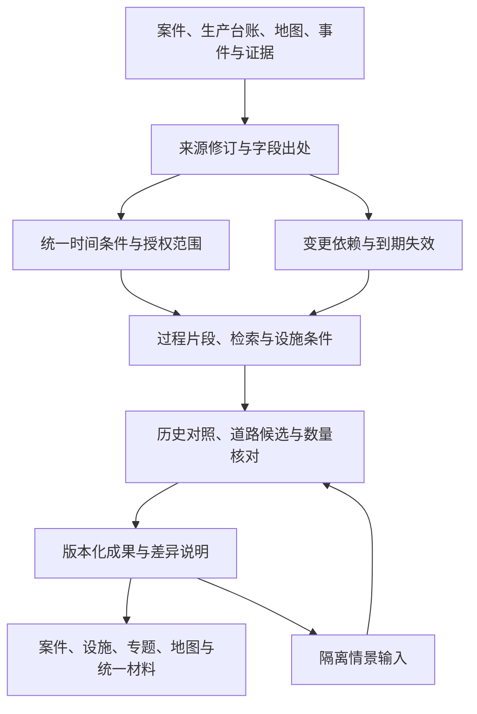

> 初稿存档（2026-09-30）：本稿以技术能力深化为主，已被用户明确的“可上线、实用可用、员工愿意使用”及“案件录入、基础数据整理录入”优先级调整。实施以 [当前路线图](2026-09-30-v7x-upgrade-roadmap.md) 为准；本稿仅作技术细节候选池，不形成另一套待执行计划。

# AiCommander 7.x 大版本升级路线图

## 从 v6.5.0-stable 到 v7.5.0-stable

编制日期：2026-09-30。状态：**规划稿，尚未实施。**

本路线图以当前源码和已发布的 `v6.5.0-stable` 为基线，覆盖六个可独立交付的版本。当前 `VERSION` 仍为 `6.5.0-stable`；编写本文件不代表开始实施、完成升级或获得对外发布授权。

基线说明见 [v6.5 发布说明](../../releases/v6.5.0-stable.md)与[验证记录](../../validation/2026-09-30-v65-implementation.md)。6.x 历史规划保留作对照，不能把其中已完成事项重新算作 7.x 新功能。

---

## 一、总体判断：下一轮不缺模块，缺的是贯通和深入

系统已经有版本化案件来源、案件过程理解、设施身份与历史资料、道路候选、后台分块处理、持续专题和统一材料。7.x 不重新建设这些能力，而是解决现有链路中仍然存在的断点：

1. **操作仍有分叉。** 管理员旧预处理、旧研判页面与新版画像链并存；部分入口要求填写内部编号、重复选对象；材料跳转后会丢失来源或条件。
2. **同一资料的使用口径还不够一致。** 时间区间案件与精确时间案件的筛选、当前设施属性与历史属性、整份台账优先级与字段实际职责需要统一。
3. **“自动更新”还可能做太多无关计算。** 内容不变仍可能重复向量化；一处变更可能让过大的范围失效；材料检索仍可能逐条读取正文再过滤。
4. **已有智能理解还没有充分转化成直观业务答案。** 用户需要知道“与历史案件哪个环节相似、差在哪里、还缺什么会改变判断”，不只是看到三个相似案例或一串支持度。
5. **涉油数量尚有独立的实用升级空间。** 涉案量、车载量、测量量、收缴量和回收量不能机械相加，但可以根据明确来源和口径进行核对。

优先级仍为：**可用性 → 实用性 → 智能化 → 真实展示价值。**

### 三项架构取舍

| 可选方向 | 本方案选择 | 理由 |
|---|---|---|
| 全面重写或按业务链逐步替换 | 模块化重构，逐段替换 | 未正式投产允许整理数据结构，但已有地图、路由、权限和材料能力值得复用；全面重写会重新引入已解决问题 |
| 增加更多业务 Agent 或深化现有能力 | 保留四项业务智能体能力与确定性编排 | 不增加质疑、复核、辩论网络；智能能力直接出现在案件、设施和专题中 |
| 每次变化全量重算或只记录选中结果的依赖 | 字段与检索范围共同驱动更新，保留保守回退 | 既减少重复计算，也能发现新增设施、新道路捷径和原本未入选对象的变化 |

### 最终业务体验

用户正常录入案件后，系统在后台完成标准化和相关分析。在同一个案件工作界面中，用户能够：

- 看到有出处的案件过程、历史条件和候选依据。
- 比较与历史案件相似及不同的环节。
- 知道哪些信息缺失真正影响当前判断。
- 在不改动事实的前提下，查看允许范围内的假设变化会怎样影响结果。
- 对有依据的涉油数量进行同口径核对。
- 从案件进入设施、区域、专题或材料，再返回原来的对象与条件。

普通用户不需要管理 Agent，不需要为每案建立专题、方案、经验卡或报告，也不增加必填的批次、道路或证据字段。

## 二、版本总览与依赖

| 版本 | 定位 | 主要交付 | 用户直接获得的价值 |
|---|---|---|---|
| **v7.0.0-stable** | 日常业务减负与处理链归一 | 修复现存口径问题，收拢旧入口，贯通对象与材料上下文 | 少选一次、少跳一页，不再面对两套当前结果 |
| **v7.1.0-stable** | 来源治理与历史条件一致 | 字段级来源、历史条件解析、导入追溯、地图维护闭环 | 知道资料来自哪里、何时有效，各页面说法一致 |
| **v7.2.0-stable** | 按影响更新与规模化分析 | 内容复用、范围依赖、可证明的候选覆盖、材料索引 | 改一处资料只更新受影响内容，大库下仍能解释计算范围 |
| **v7.3.0-stable** | 案件环节与历史条件对照 | 过程片段对照、差异解释、持续专题业务模板 | 回答“相似在什么环节，差异为何重要” |
| **v7.4.0-stable** | 关键补充与隔离情景分析 | 缺口影响排序、同版输入下的受控假设比较 | 回答“补什么最有用，条件改变后结论怎么变” |
| **v7.5.0-stable** | 油品批次与数量核对 | 同口径计量对照、重复提示、明确批次关系下的数量差异 | 回答“这些油量能否比较，差异来自哪里” |

实施顺序：`7.0 → 7.1 → 7.2 → 7.3 → 7.4 → 7.5`。

- v7.1 先确定来源、时间、明细身份和计量口径，后续依赖追踪与数量核对才能稳定。
- v7.2 复用 v6.4 已有分块续跑，不重复建设任务系统。
- v7.3 复用已有过程理解，不再次新建画像或知识库。
- v7.4 复用道路、候选及已有覆盖比较，不另建一套沙盘算法。
- v7.5 是实际业务升级，不是单独的验收、反馈或比赛包装版本。

不承诺固定发布日期。先完成各版真实业务闭环，再决定是否达到 Stable；不为凑齐版本号扩充功能。

## 三、共同业务与数据架构

### 保留不同数据层，不制造“万能综合画像”

| 数据层 | 内容 | 约束 |
|---|---|---|
| 原始来源 | 案件原文、台账行、测量记录、证据、事件及来源修订 | 保留出处；Agent 不自动改写 |
| 派生条件 | 过程片段、标准标签、设施对应、时间解析、检索索引 | 可以自动生成；必须能追溯来源与规则 |
| 冻结成果 | 候选、对照、专题、数量核对、材料与情景结果 | 绑定具体输入；不混用新旧版本 |
| 人工判断 | 确认、排除、备注及来源裁决 | 对应明确对象与版本；新结果不得静默继承旧确认 |

“单一处理链”指同一来源版本只走一套有效的整理与发布流程，不是把这四层合并成一个大字段。

### 复用与重构边界

- 继续使用现有 Python 后端、前端、PostgreSQL/PostGIS、pgvector、Valhalla 和离线地图包。
- 继续使用 `DomainChange`、`ChangeDelivery`、来源修订、现有任务状态、材料和判断对象。
- 按案件读取、来源解析、设施条件、检索计算、材料交付等职责拆分过大的服务和页面；不以文件行数作为删除依据。
- 不拆微服务，不更换前端框架，不再建立资产主库、案件副库或第二套生产向量索引。
- 历史会议、奖励测算、独立事件、已确认经验、人工判断和历史报告保留其原有业务含义；减少入口不等于删除这些功能。

## 四、逐版本路线

### v7.0：日常业务减负与处理链归一

**定位：先解决现存断点，不把补齐旧承诺包装成新的智能算法。**

#### 7.0-A：先修三类一致性问题

1. **统一案件时间筛选。** 精确时刻按查询窗口匹配，案发区间按相交匹配，时间未知单列。先形成共用查询契约，再改案件列表、历史检索、专题、地图和材料。
2. **来源和附件可完整翻阅。** 接通已有分页能力，不再只展示最近固定数量，也不要求用户切换接口寻找更早记录。
3. **保留历史条件与返回路径。** 案件、设施、助手、专题、地图和材料跳转继承对象、时间、版本与筛选；从材料返回时恢复原上下文。

时间口径特别规定：

- 查询窗口统一使用起点包含、终点不包含的约定；原始时间精度和时区保留。
- 跨日、跨月区间不能伪造为某一天的精确案件；统计区分“明确属于本期”“可能涉及本期”“时间未知”。
- 同一窗口内按案件去重；跨窗口的区间匹配数量不直接相加冒充唯一案件总数。
- 历史上起止相等的区间须有明确的零时长匹配规则并保留来源表示，不能悄悄视为空集或直接清洗掉。
- 比较同长度周期时展示不确定部分，不用区间重叠数制造确定的增减结论。

#### 7.0-B：收拢旧处理与旧研判入口

- 列出旧预处理、`Case.features`、案件智能页及旧部署页的实际消费者和独有功能。
- 管理员重建、批量处理、失败重试统一进入版本化后台管线；退出旧独立写入路径。
- 旧摘要无可靠来源版本时只作为历史读取，不覆盖当前标准结果。
- 案件智能页的历史参考、已有报告和有效经验能力归入当前案件与材料入口；稳定深链接继续定位到对应内容。
- 旧部署页中仅靠邻近圆圈、固定时段或机械资源数量产生的建议退出日常新增输出；有独立价值的历史统计与材料保留。
- 已淘汰的执行型模块不恢复；也不把“部署参考”扩大为实际巡逻或处置流程。

实施采用“消费者清单 → 新契约适配 → 停旧写 → 验证旧读 → 清理确无消费者的实现”。不能先删页面再发现历史功能丢失。

#### 7.0-C：日常入口按对象组织

- 现有案件工作界面承担阅读和操作；原始事实、过程片段、标准画像、候选依据、人工判断保持分区。
- 预设问题改为授权内可搜索的对象选择，不要求输入内部 ID；从案件、设施进入时自动携带对象。
- 允许地图选点的功能明确区分正式记录和临时分析位置，不把临时点位保存为案件事实。
- 提供少量基于现有工具的快捷操作，例如“看历史相似环节”“查看设施适用资料”“整理当前已有材料”；只启用已有能力，不提前冒充 v7.3 深化功能。
- 工作台围绕近期对象、必要补充、依据变化和用户主动保留的判断组织；同一变化不重复制造待办。
- 报告与经验按需使用，未生成报告、未沉淀经验或未确认每个候选不代表案件业务未完成。

#### 7.0-D：能力状态说清楚

复用现有健康接口，区分“未配置、已配置、连接可用、数据就绪、曾完成真实验证、当前故障”。模型数量不等于模型可用，配置了地图来源不等于离线包可用；历史验证也不替代当前状态。

该状态供管理员定位问题，普通用户只看当前模块可用、降级、待处理或受限；不增加日常操作页。

**实现重点：** `cases` 与旧预处理服务、案件工作界面、旧案件智能/部署入口、来源附件分页、共享跳转上下文、材料返回路径。

**Stable 验收：**

- 精确、区间、未知时间及跨时区、跨月、相等边界场景在列表、检索、专题与材料中口径一致。
- 同一来源修订只产生一条有效整理链；保存、重试、取消不会形成两套当前摘要。
- 打开页面不触发模型、道路计算或业务写入。
- 历史来源与附件可翻到末页；旧报告、经验、会议和人工记录可访问且权限不变。
- 用户能够从案件进入设施与材料，再回到原筛选和历史时间条件；无需手填 ID。

**本版不做：** 新的过程推理模型、数量核算、全厂道路补齐、界面全量重画。

---

### v7.1：来源治理、历史条件与地图维护

**定位：让“从哪里来、什么时候适用、为何采用这个值”成为各入口共同的答案。**

#### 7.1-A：从整份来源优先，改为字段或字段组职责

沿用现有设施 ID、来源记录、要素声明与版本，支持按字段职责选择有效值：生产属性可由生产台账负责，坐标可由已核验 GIS 负责，入口可由核验记录负责。职责须由明确规则配置，不由模型临时打分决定。

- 每个参与分析的值保存原值、单位、来源及修订、业务有效期、系统获知时间、核验状态和规则版本。
- 区分未提供、未知、明确清空、撤销与冲突，不能把空值一律解释为删除。
- 低优先级来源补空须有明确规则；同级冲突保留冲突，不自动选最新的一条。
- 有业务耦合的字段整体解析，例如“经纬度＋坐标系＋精度”“含水率＋计量口径＋测量时间”，不从不同来源拼成未经核验的组合。
- 只隔离受冲突影响的字段与计算；不会因为无关属性冲突让整口井消失，也不让关键冲突继续冒充可靠条件。
- 人工裁决绑定具体来源与版本，撤回或更正通过新记录表达，不重写旧裁决历史。

#### 7.1-B：统一历史条件解析

提供各业务共用的时间解析服务，明确两个时间：

- **业务有效时间：** 资料描述的是哪个时期的状态。
- **系统获知时间：** 系统截至何时知道这条资料。

支持两种明确标注的使用方式：

1. 回放当时结果：固定当时获知范围，不混入后来补录的资料。
2. 用现有资料回看历史：允许使用后来取得、但确实描述历史状态的资料，并标明迟到补充。

案件候选、设施档案、区域条件对照、检索与材料使用同一解析器，不只是旁边附一张历史资料卡。案发时间为区间时，区分全区间支持、部分覆盖、区间内发生变化和无法确定；不擅自取中点替代。

**历史数据能否读取始终按当前权限判断，不能用历史权限绕过已经撤销的访问。**

#### 7.1-C：贯通导入、明细与引用

- 导入批次、工作表、行号、来源修订、案件/设施对象和材料引用可相互定位；复用现有导入回执，不要求重录来源。
- 地点、车辆、人员及计量明细采用稳定明细标识或可验证的跨版本对应；无法证明延续关系时保留未知。
- 不按数组位置、同名、同数值自动认定“还是同一条记录”。
- 提供来源前后对照：新增、修订、撤销、有效期变化及受影响字段。
- 提前冻结油品、测量时间、单位、毛净口径、含水率依据、业务环节与可选批次引用的契约，为 v7.5 铺基础；本版不做完整数量平衡。

#### 7.1-D：把已有地图维护能力接成可用流程

前端接通既有分片上传、后台验包、构建状态、发布和回滚能力。管理员在同一维护流程中看到：包集是否完整、资源是否就绪、当前发布版本、失败原因及上一有效版本。

- 大包上传支持既有断点续传与后台验证，不只提供一次性 ZIP 上传入口。
- 验包、发布、回滚仍复用现有权限与原子切换；失败不替换可用地图。
- 普通用户不参与制包和发布，案件、辖区、大屏继续共享已发布的地图能力。
- 不重下载或重做两市底图；来源或格式未变化时复用已有地图与路网证明。

**实现重点：** 地图来源裁决、设施身份与历史解析、来源引用/明细契约、导入回执、离线地图管理界面。

**Stable 验收：**

- 跨来源互补、同级冲突、明确清空、撤销、迟到更正及单位差异有固定验证。
- 同一设施、同一时间与获知上下文，在案件、设施、区域及材料中获得一致的适用条件。
- 重排序、同值重复、删除后新增不会错误串联明细；引用可回到准确来源版本。
- 历史成果保留原输入；当前撤权使历史内容同样受限。
- 地图包上传中断可恢复；验包失败保留旧版本；回滚后各地图入口一致。

**本版不做：** 通用主数据平台、全字段人工审批、自动猜测坐标系、强制所有来源补齐有效期。

---

### v7.2：按影响更新与规模化分析

**定位：在已有后台续跑基础上减少无效工作，并把“算了多少、还有多少没算”说清楚。**

#### 7.2-A：检索与画像按内容复用

- 原文片段规范化内容、嵌入模型与配置未变时，复用已有向量，不因无关车辆处理字段变化或画像晚到而重复编码。
- 内容复用不等于来源复用：每次修订仍记录身份和引用；`A → B → A` 不能抹去中间变化。
- 索引任务按案件隔离失败，坏记录进入可解释的重试状态，不回滚整批已成功案件。
- 删除、撤销或授权收窄立即影响读取；索引暂未清理不能成为继续交付旧内容的理由。

#### 7.2-B：从全局失效深化为字段与范围依赖

复用已有变更和投递机制，补充三类依赖：

1. 已引用的来源、字段组、规则与版本。
2. 检索条件、授权范围、空间分区与候选目录水位，包括尚未选中的对象。
3. 时间有效期与条件到期，不能只等待下一次数据写入才失效。

新增设施、原本不匹配的设施发生变化、新道路形成捷径，也可能影响既有结果。不能只盯住“旧路径经过哪些道路”或“最终三个候选”。

- 能可靠冻结输入的任务使用明确的来源与集合版本；后续更新提示有新版，不拼接到旧任务中。
- 无法冻结的任务保留版本复核与失效保护；范围依赖未证明完整前，不删除现有全局防混版机制。
- 不能可靠判断影响范围时，记录原因并进行保守重算，不宣称精确增量。
- 更新旧结果的有效状态，不改写其内容；人工判断继续绑定原版本。

#### 7.2-C：候选比较支持分区覆盖证明

当前后台本就不只比较三个目标；本版不是简单把候选上限调大，而是为较大范围提供有边界的分批计算。

- 冻结授权集合、空间范围、条件、资料版本、排序规则和预算后，分区召回、核验入口、分批道路计算。
- 分别记录可核对的扫描完整度、召回数量、可信入口可计算数、道路已比较数及未完成原因。
- 设施数、计算次数、耗时、存储和同用户并发共同限制预算；扩大范围属于新任务，不悄悄改变旧任务含义。
- 支持已有任务机制下的暂停、取消与恢复；候选去重依据稳定 ID，而非名称。
- 仍默认展示最多三项主要候选，允许查看依据和计算范围，不把更多后台计算变成更长的日常阅读负担。
- “完成”只指已声明且获授权的计算范围完成；不声称全厂真实道路已覆盖或已找到全域最优。

#### 7.2-D：材料检索与工作界面减少重复读取

- 建立可从来源重建的材料目录投影和对象反向引用，用于标题、类型、对象、时间、版本、有效状态等检索。
- 正文仍在打开或导出时读取，避免先读取大量正文再执行每一次目录筛选。
- 当前权限在计数、筛选分页及交付时一致执行；索引不是授权凭证，受限标题、摘要与数量均不得泄漏。
- 案件工作界面的子模块共享读取上下文，避免重复构建同一份画像和会议/材料关联。

**Stable 验收：**

- 无关字段变化不重复向量化；一个案件失败不阻塞其他案件。
- 固定输入下，增量结果与全量计算结果一致；新增对象、撤销来源、条件到期、新道路捷径均能触发应有变化。
- 分区结果与小规模完整扫描一致；中断续跑不重复、不混版；预算耗尽明确返回部分完成。
- 权限变更在续跑、发布、目录分页、读取和导出前均有效，不能读取缓存绕过。
- 与冻结基线相比，记录重复计算量、案件保存 P95、读取耗时和任务完成度；不以扩大截断或减少授权数据换取表面提速。

**本版不做：** 无限自动扩圈、取消全部预算、全厂最优承诺、为提速弱化权限或来源版本检查。

---

### v7.3：案件环节与历史条件对照

**定位：从“找到相似案件”深化为“解释相似发生在哪个环节，以及差异如何限制参考价值”。**

#### 7.3-A：复用过程片段，形成并列对照

不新建画像，复用已有时间、行为、地点、设施、油品、工具、车辆及上下游片段。对当前案件与少量有依据的历史案件，按可证明的环节并列展示：

- 明确记录了什么，原文位于哪里。
- 哪些行为、地点或设施条件相似。
- 哪些关键条件不同，是否影响经验适用。
- 哪些属于否定、不确定、矛盾或缺失。
- 哪个环节缺少证据，无法建立对应。

“盗取、转移、运输、囤储、销赃”等只是可能的对照维度，不是要求每案填满的固定链条。没有来源支撑的环节留空，不自动拼成完整犯罪过程。

默认提供少量最相关对照，展开后可看检索覆盖和其他结果。相似度或规则支持度不称为事实发生概率，也不代表正式串并案。

#### 7.3-B：把差异与道路、生产条件放在同一份依据中

- 历史案例使用其适用的设施、道路及时间资料；缺少历史通行条件时明确不可还原。
- 对照结果引用 v7.2 已有候选和道路依据，不重新读取全部案情再分析一遍。
- 可以解释“手法相近，但油品条件不同”“设施属性相近，但入口资料缺失”等实际差异。
- 支持在片段层面做可选备注或纠正判断，绑定来源与片段版本；不覆盖案件原文，不复制成第二套事实库。

#### 7.3-C：深化持续专题的业务模板

在现有专题和受控工具中增加少量模板，例如：

- 同类取油方式在不同地点条件下的差异。
- 不同时间段运输工具、油品和转移线索的变化。
- 指定设施或区域的明确关联、空间邻近与候选关联对照。
- 某类关键资料缺失对已有分析的影响。

模板首先生成可阅读的条件，用户可以修改或直接使用；专题标题仍只是名称，不能把标题文字冒充已经执行的查询。自然语言转换必须返回实际使用的工具、条件与范围。

专题统计使用全体授权匹配数据，典型案例只是解释样本。案件页、专题图表、地图和周期材料引用同一冻结成果，不各自生成新的统计口径。

**Stable 验收：**

- 同义表达可以形成有出处的环节对应；否定、不确定和明确陈述不混合。
- 不存在的环节不被补齐，历史相似不自动变为当前事实或正式关系。
- 每项相似与差异可回到准确来源版本；来源撤销或权限变化后无法继续交付失效内容。
- 图表、地图和导出材料引用相同冻结条件；分页不改变总体统计。
- 模型未接通时，规则可完成的对照仍可使用；深层语义部分明确未启用或未知。

**本版不做：** 新知识库操作流程、多 Agent 讨论、自动认定嫌疑人/团伙、根据同人同车机械串并案件。

---

### v7.4：关键补充与隔离情景分析

**定位：帮助用户理解“哪项信息值得优先补充，以及允许条件下的变化会影响什么”。**

#### 7.4-A：从一般缺项提示深化为缺口影响说明

复用当前案件的缺项入口，不新增补充任务、审批或必填表单。

- 区分基础录入缺项与影响当前分析的关键缺口。
- 展示该缺口影响哪些候选、历史对照或数量核对，以及为何影响。
- 只有能从现有计算依赖或受控比较得到支持时，才给出补充优先级；不靠模型猜测“补了就有用”。
- 最多优先展示三项；无足够依据排序时直接说明无法判断，不再造一个笼统的完整度分数。
- 用户后来补充资料，系统使用原有变更链更新结果，并解释原先未知的部分是否得到解决。

示例：不是泛泛提示“请补充车辆信息”，而是说明“当前可用路网分别支持两种已定义参考车型，车型差异影响某个候选能否进行可达性比较；未知时不能选择其中一种作为事实”。

#### 7.4-B：同一冻结输入下的受控假设比较

使用已有候选、道路及覆盖比较服务，在隔离输入上形成“基线—情景—差异”结果：

1. 选择一份仍可使用且当前有权限的基线。
2. 仅改变白名单中的分析变量，其他资料、算法和范围保持一致。
3. 调用相同确定性服务，记录变动项及计算能力边界。
4. 比较候选、可计算状态、条件支持度或名义覆盖的变化，并引用原有依据。

首版允许的情景以真实计算能力为限，例如：

- 在当前已授权且有效的参考车型配置之间比较。
- 在已有案发时间区间内比较有资料支撑的子窗口，不把子窗口认定为真实案发时间。
- 在已知且获授权的入口之间比较，或模拟停用一条当前允许通行的道路。
- 在具备实际几何资料的既有覆盖比较中模拟减少已知资源，不虚构设备覆盖能力。

用户可以查看日常成果而完全不使用情景功能。情景是可选的解释工具，不是又一条必经流程。

#### 7.4-C：假设不改变授权与事实

- 假设不能开启禁止道路、绕过未知门禁、扩大资料权限或把未知入口改为可信入口。
- 路网必须与分析时间、车辆条件和当前通行权限相容；不能拿旧图改文字冒充新路由。
- 不支持的道路开放、新建道路或未知设施属性情景，明确标记“当前资料/计算能力不支持”；不回退为直线估算。
- 白名单内的假设值也不成为已核验来源，不能自动进入正式案件、设施属性或通行规则。
- 基线失效、来源过期或期间撤权时停止新计算或导出，提示重新选择有效基线。
- 展示和材料均标明假设清单、基线版本及适用边界；差异不被表述为因果证明、实际轨迹或防控收益。

**Stable 验收：**

- 零变量变化产生一致结果；只改一个允许变量时，结果差异可追溯到该变量或明确的计算状态变化。
- 车型与路网不相容、历史条件缺失、途中撤权、预算耗尽均有明确状态。
- 缺口排序能说明依据；没有可验证影响时不虚构优先级。
- 情景运行后原始案件、地图、通行规则与人工判断零改写。
- 页面与导出都能清楚区分事实和假设，日常用户不被要求创建情景。

**本版不做：** 反向优化违法行为、推断真实行驶轨迹、自动部署人员、自动产生调查或执法任务。

---

### v7.5：油品批次与数量核对

**定位：利用已有涉油记录解释可比较的数量差异，不扩建库存、财务或物证流转平台。**

#### 7.5-A：先判断能不能比较，再计算差异

沿用 v7.1 的计量契约与现有测量记录，将案件记载量、车载量、独立测量、收缴和回收记录按来源与环节并列展示。

每次比较先核对：

- 是否有明确的同批、同对象或同次测量关系。
- 单位是否相容，是否有可信转换条件。
- 测量时点、业务环节和方法是否可比。
- 毛重、净重、液体总体积、折算油量等含义是否一致。
- 含水率、密度、温度等换算依据是否确实存在且适用于该记录。

单位不同不一定不能比较，但不能自行假定密度把升换算成吨；车辆总重不等于油品净重；一次收缴、一次转移和一次回收不天然是三份独立油量。

#### 7.5-B：可选的批次与明细对应

- 复用案件和测量明细的稳定 ID，增加必要的可选批次引用及明确的分拆、合并、转移关系。
- 只有来源明确记载的对应或人工显式确认可以建立关系；名称、时间、数值相近仅作为待核提示，不能自动认定同批。
- 同一批次的多次测量保留差异，不因为数值相同就删除，也不当成新增数量累加。
- 无批次资料时仍能对单案明确同口径记录做核对；“批次未知”不是新增必填项。
- 分拆、合并或部分转移只记录已有事实，系统不发起出入库、调度或保管流程。

#### 7.5-C：交付可用的核对结果

输出包括：来源记录、业务环节、可比性、原值与可验证换算、差异、可能重复引用及具体缺口。

- 只有可比记录才计算差异，保留原始精度，不能用四舍五入掩盖差异。
- 同批多测采用明确的比较规则，不静默选最大值、最新值或平均值作为“真值”。
- 缺失环节、测量方法不同或来源冲突时返回不能完成平衡的原因。
- 数量差异不自动认定为损失、盗取量、隐瞒、违法或人员责任。
- 结果进入案件工作界面和统一材料；专题汇总仅纳入相容口径，未知与不可比部分单列。
- 补录、更正或撤销资料后说明哪些数值与材料受到影响；原冻结报告保留历史版本。

**Stable 验收：**

- 覆盖一批多测、多批同值、不同单位、毛净重、含水率口径、部分转移和缺失环节。
- 没有对应关系时不自动建立批次；相同数值不会导致错误去重或错误串联。
- 重复测量、转移和回收不被重复计入新油量；无法比较不输出伪完整平衡。
- 单案、专题和报告采用相同口径与冻结来源；变化说明能定位到具体明细。
- 无批次资料、模型不可用或核对失败均不阻断案件保存和已有分析。

**本版不做：** 出入库系统、财务核算、赔偿/处罚计算、物证审批、自动认定涉案总量或责任。

## 五、数据与接口演进

以扩展现有契约为主，不预先建设一套泛化平台。具体数据库表与路由命名在各版设计时确定；下列是必须保持的业务契约，不代表已经存在的新接口。

| 契约 | 主要增加内容 | 首次交付 |
|---|---|---|
| 案件查询与工作界面 | 共用时间语义、模块状态、上下文返回、统一来源版本 | v7.0 |
| 页面上下文 | 对象类型/ID、时间条件、成果引用与返回筛选；仅作导航，不能充当授权凭证 | v7.0 |
| 来源与历史条件解析 | 字段/字段组声明、有效时间、获知时间、裁决策略和状态 | v7.1 |
| 导入与明细引用 | 批次/行/修订追溯、稳定明细身份、可选计量批次语义 | v7.1 |
| 变更与计算依赖 | 字段、检索范围、目录水位、到期、授权及算法版本 | v7.2 |
| 候选计算完整度 | 声明范围、扫描与道路比较进度、预算及未完成原因 | v7.2 |
| 材料目录投影 | 授权内查询字段、对象反向引用、源版本和有效状态 | v7.2 |
| 环节对照 | 双方片段引用、相似与差异、否定/不确定状态、适用边界 | v7.3 |
| 情景比较 | 基线、白名单变量、假设清单、输入版本、差异与可计算状态 | v7.4 |
| 数量核对 | 记录关系、口径、换算依据、可比性、差异及缺口 | v7.5 |

新增持久化只保存必要的来源关系、依赖、派生索引与冻结成果。不存在可靠对应时允许空值和未知，不为了满足结构而生成虚假关联。

### 统一状态与安全规则

- 缺资料、未接通、待计算、部分完成、计算失败、已过期、权限受限分别表达；不能都显示为零、无结果或不可达。
- 敏感原文与精确生产坐标保留内网。查询内容同样受出域规则约束；兼容某种模型协议不意味着可以发送原文。
- 原文中的指令只作为资料内容，不能改变工具、权限、模型地址或执行规则。
- 不提供任意 SQL、Shell、文件路径或外部 URL 的执行能力。
- 查询、计算、缓存、历史阅读与导出统一复查当前权限；内部道路许可与资料可见性分别校验。
- 缓存和成果携带来源、授权、地图、道路、条件、模型/算法及必要的时间版本，不只记录一个应用版本号。

## 六、能力分工与有条件扩展

### 智能化如何发挥作用

| 执行者 | 负责内容 | 不负责内容 |
|---|---|---|
| 确定性服务 | 权限、历史条件、统计、道路、计量、差异与有效状态 | 无证据补造事实 |
| 本地规则与内网模型 | 原文片段理解、受控条件转换、相似环节辅助对应 | 自动认定人员、关系或真实路径 |
| 可选语言模型 | 在受控数据和工具内组织问题、表达对照与缺口 | 修改评分、伪造引用、直接写正式数据 |
| 既有编排器 | 幂等、触发、预算、取消、失败隔离和版本校验 | 新增一轮质疑、复核或多 Agent 辩论 |
| 人工 | 正常录入、按需补充、判断有价值的候选与材料 | 手动替 Agent 挑选一批案件和井点 |

模型驱动能力与规则能力分开标识。未配置真实模型时，能够确定性完成的功能继续交付；不能把规则预设或当前聊天模型标为系统真实模型运行。

### 技防设备级覆盖：有数据后再启动的可选工作包

现有技防摘要或附近设备点不足以证明实际覆盖。若后续取得设备位置、覆盖几何/方向、有效期、在线状态及必要的遮挡资料，可扩展现有覆盖比较。

- 没有视场与遮挡资料时只显示名义覆盖，不称实际覆盖。
- 未找到技防资料不等于没有技防；某时段事件数为零不等于没有事件。
- 不接入连续视频、抓拍原图、完整车牌或新的外部业务系统。
- 不等待这些资料收齐才完成 7.x 通用源码版本，也不把该可选能力列入无条件交付成果。

## 七、实施与验收方式

### 每版采用相同但适度的工作节奏

1. 核对当前源码、已有修复和独有业务消费者，冻结本版范围与不做事项。
2. 先确定影响跨模块的时间、来源、权限或计量契约，再编写对应实现。
3. 开发期间只运行受影响模块的验证；保留已有地图、路由与构建证据。
4. 收口执行一次核心回归、本版完整用户流程和涉及的迁移/恢复验证。
5. 记录通过、失败、未验证及现场依赖；达到本版门槛后才更新版本和发布材料。

权限、时间语义、来源关系、道路硬限制及增量计算等高风险改变需要对应真实组件验证；不能为了节约时间用模拟结果替代。无关模块不重复全量重跑。

### 共同技术门槛

- 核心案件保存、导入、地图、检索、历史材料和权限回归通过。
- 页面读取不触发正式数据写入；Agent 自动覆盖原始事实为零。
- 未授权读取、权限受限的计数/摘要泄漏、敏感外发为零。
- 断公网、清空浏览器缓存后，地图可从内网服务器首次打开；地图或路由故障不阻断案件保存。
- 关闭智能能力后核心业务可用；模型和队列异常分别呈现真实降级状态。
- 历史结果不拼接当前资料；新输入不会静默继承旧确认。
- 源码迁移、旧入口兼容与恢复不会丢失升级后的原始案件、证据、生产资料和人工决定。
- 性能使用固定环境、数据规模和工作负载对照：案件保存 P95 相对基线退化目标不超过 5%；常用地图冷启动沿用 5 秒目标，并注明实际测试环境与结果。

“零”是相关权限矩阵、故障场景和数据检查的验收要求，不代表可以仅凭通过测试宣称系统绝无风险。

### 验收证据分层

| 层次 | 能证明什么 | 不能替代什么 |
|---|---|---|
| 源码与针对性测试 | 逻辑、契约、权限路径及已覆盖边界 | 真实模型效果、现场性能 |
| 隔离集成与浏览器流程 | 真组件组合、迁移、离线地图、用户操作 | 正式投产与业务有效性 |
| 真实配置模型 | 指定模型对已批准测试输入完成受控调用 | 其他模型或正式案情全部有效 |
| 目标服务器 | 目标环境连接、资源、部署和性能 | 长期业务价值 |
| 实际业务使用 | 可用性、解释价值及真实资料缺口 | 没有数据支持的覆盖或准确率承诺 |

不恢复 30 天试用、固定数量真实案件、完整厂内道路或全部现场确认作为源码 Stable 门槛。真实模型未接通、道路或字段来源资料不足时，相关效果标为未启用、部分覆盖或待验证；不能计入已验证能力。

### 最小业务验收链

每版在既有基础上增加本版步骤，而不是重造一批独立演示数据：

1. 正常录入一个具有区间时间和部分未知条件的案件。
2. 自动形成当前来源版本的画像与相关分析；页面不要求手动运行预处理。
3. 进入设施，查看相同历史上下文，再打开同版材料并返回。
4. 修改一项已有资料，区分应受影响与不受影响的结果。
5. 比较历史环节与差异，明确保留无证据的未知。
6. 使用一个允许的情景变量，查看隔离结果；确认原始事实未变化。
7. 对已有明确计量关系核对数量；加入一项不可比记录，验证不会强行相加。

## 八、发布、兼容与回退

- `v6.5.0-stable` 保留为不可变系列基线；上述问题通过后续修复交付，不回写旧标签。
- 每个 `v7.x.0-stable` 完成后，在发布授权范围内统一更新一次 GitHub：代码、发布说明、迁移步骤、验证记录、能力边界和恢复说明。
- 普通修正随当前工作包积累，不每次单独建立 Release；生产阻断或高危安全问题才考虑 hotfix。
- 每版保留上一 Stable 的相容程序、数据库和必要文件恢复点。恢复数据库与回退程序分别设计，不让旧程序直接访问不相容新库。
- 未正式部署使结构性重构更容易，但不等于所有现有数据都可删除。当前演示资料、原始导入、地图包及人工记录仍先辨认用途、备份和保留。
- 只有明确指定的可丢弃隔离环境才允许采用重建策略；不能自动清空工作库来通过迁移。
- 旧写入退出后，稳定深链接保留适配；历史成果读权限和来源语义不变。
- 本文件本轮只新增规划，不修改应用版本、不提交、不推送、不部署。

## 九、最终交付效果与竞赛亮点

到 `v7.5.0-stable`，7.x 的新增价值应集中为六件事：

1. **一次正常录入，沿一条有效处理链使用成果。** 不重复预处理，不在多个页面重选案件。
2. **同一时间和来源条件，全系统使用相同答案。** 能说明这条生产属性当时是否有效、系统何时知道。
3. **新增一条资料，只更新应受影响的内容。** 能展示变化来源、范围和未完成部分，不只是后台重新转一遍。
4. **历史案件按环节真正帮助当前分析。** 相似、差异、反向条件和缺口都能回到原文。
5. **受控情景展示计算如何随条件变化。** 基线与假设隔离，不伪装成事实或自动工作部署。
6. **油品数量能够有口径地核对。** 相同批次不重复计数，无法比较时说清具体原因。

竞赛展示复用同一业务链：**录入案件 → 历史环节对照 → 补充一条依据 → 展示受影响结果 → 比较允许情景 → 导出同版材料**。数量核对作为有真实口径的业务亮点补充。所有示例均明确是隔离脱敏测试、真实配置运行还是历史轨迹回放，不另造一套展示算法。

**7.x 的核心成果：不仅能给出分析，还能说明资料怎样支持分析、哪些变化真正影响分析，以及什么情况下必须保留未知。**

## 十、当前源码依据与首批落点

以下为本轮审查定位到的实现，不是新增功能已完成的证明。后续若代码变化，应以实施时的实际消费者与测试为准。

| 现状或待核对点 | 当前入口 | 对应工作 |
|---|---|---|
| 精确/区间时间契约与搜索条件需一致 | [录入契约](../../../backend/app/services/case_intake_contract.py)、[案件搜索](../../../backend/app/services/case_search_service.py)、[片段检索](../../../backend/app/services/case_history_fragment_search.py) | 7.0 时间筛选与统计口径 |
| 旧预处理仍有独立输出，需逐一适配消费者 | [预处理](../../../backend/app/services/preprocess_service.py)、[画像服务](../../../backend/app/services/case_profile_service.py) | 7.0 停旧写、保旧读 |
| 历史来源/附件与材料跳转仍需贯通 | [来源明细](../../../frontend/src/pages/Cases/CaseSourceDetails.tsx)、[证据附件](../../../frontend/src/pages/Cases/CaseEvidenceFiles.tsx)、[设施材料操作](../../../frontend/src/components/Facility/FacilityMaterialActions.tsx) | 7.0 分页与上下文 |
| 来源优先及整体属性写入需要字段职责深化 | [设施身份](../../../backend/app/services/facility_identity_service.py)、[地图来源治理](../../../backend/app/services/map_foundation_service.py) | 7.1 字段/字段组来源 |
| 档案当前内容与历史条件需要同一解析口径 | [设施摘要](../../../backend/app/services/facility_summary_service.py) | 7.1 时间解析 |
| 地图分片导入后端能力已有，需贯通维护界面 | [包导入](../../../backend/app/services/map_package_import_service.py)、[地图管理](../../../frontend/src/pages/Jurisdiction/OfflineMapManager.tsx) | 7.1 地图维护闭环 |
| 历史片段索引与任务失败粒度可优化 | [索引服务](../../../backend/app/services/case_history_index_service.py)、[片段构建](../../../backend/app/services/case_history_fragments.py)、[任务](../../../backend/app/tasks/case_history_tasks.py) | 7.2 内容复用与失败隔离 |
| 全局来源变更保护安全但范围较宽 | [修订保护](../../../backend/app/services/topic_revision_fence.py)、[专题依赖](../../../backend/app/services/topic_dependencies.py)、[后台聚合](../../../backend/app/services/profile_aggregate_jobs.py) | 7.2 先证明依赖，再缩小失效范围 |
| 候选预算与材料正文读取影响大规模使用 | [候选池](../../../backend/app/services/facility_candidate_pool.py)、[材料目录](../../../backend/app/services/result_catalog.py) | 7.2 覆盖证明与目录投影 |
| 过程片段、版本化判断已有，不需重建 | [过程服务](../../../backend/app/services/case_process_service.py)、[人工判断](../../../backend/app/services/result_judgment_service.py) | 7.3 深化对照 |
| 路由已绑定时间、车辆与通行授权 | [路网服务](../../../backend/app/services/road_network_service.py)、[道路许可](../../../backend/app/services/road_access_policy.py) | 7.4 复用硬约束，不增旁路 |
| 已有测量信息可扩展，不另建库存台账 | [案件来源与测量](../../../backend/app/models/case_source.py) | 7.1 契约前置、7.5 数量核对 |

**建议第一批实施只做 v7.0：冻结时间语义 → 修复筛选/分页/上下文 → 列明旧路径消费者 → 统一后台写入 → 日常入口适配 → 本版回归与发布准备。** 不同时展开六个版本，避免为了赶最终版本再次积累半完成链路。

