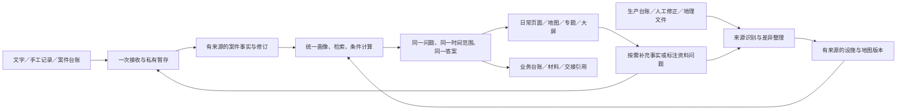

# AiCommander 9.x 大版本升级路线图

## 从 v8.4.0-stable 到 v9.4.0-stable：从功能齐备走向日常好用

日期：2026-10-09。状态：**基于当前代码审查形成的建议稿，未开始实施，不代表已发布或已投产。**

源码基线：`VERSION=8.4.0-stable`，本地提交 `4478275`。本轮检查了录入、导入、基础数据、画像、检索、智能查询、成果、权限、运行配置和首次交付相关代码与文档；没有逐行审计全部源码，没有启动系统开展员工操作、性能或现场验收。

工作区已有首次上线、演示、设计及运维文档修改保持原样。本路线图不恢复任何旧实施计划，不授权清库、部署或 GitHub 发布。

## 一、总体判断

**9.x 应定位为“面向首次上线的产品化重构”，不再以增加页面、智能体和审核步骤为目标。**

系统已经具备私有草稿、幂等保存、来源修订、Excel 映射、离线地图、设施身份、历史检索、道路分析、专题、业务回答和 Word/PDF。真正需要解决的是：

1. 功能存在，但员工仍要重复输入、主动保存草稿、理解技术状态。
2. 单次导入可用，但长期收到更新台账时，仍有重复配置、重复建案和逐行纠错风险。
3. 同一业务语义、资料写入与答案生成仍有新旧路径并存。
4. 成果能生成，但正常资料更新后，部分历史答案不能继续引用。
5. 模型适配器已经存在，但真实内网智能效果仍缺验证，不能把规则功能改名为智能升级。
6. 交付脚本已有基础，但管理员仍需理解较多镜像、开关、队列和资源组合。

首要业务价值仍是用户已明确的两项：**案件录入省事、数据基础底座整理录入省事。** 查历史、看区域和整理材料必须建立在这两条主链可持续运行之上。

### 1.1 为什么不是推翻重来

推荐保留现有技术栈、主要业务实体和可用服务，直接重构薄弱连接处：

| 处理方式 | 范围 |
| --- | --- |
| 保留并复用 | 原始案件、事件、线索、人员车辆、油品处置、原件、来源修订、设施稳定编号、地图与路网、经验、会议、专题、人工判断和历史材料 |
| 合并实现 | 多种地图写入规则、重复文本录入、不同问题答案契约、重复时间口径与状态展示、过多的配置解释 |
| 降级为高级入口 | 多模型会议、图谱深入操作、实验 Agent、批量重建、调试和重放；不删除其独有功能 |
| 停止新写入或新传播 | 无来源的默认风险/可信数值、旧自由 JSON 中不明确的派生事实、同一字段的多头写入；先盘点消费者，再改为只读兼容 |
| 不恢复 | 已退出的巡逻执行、人员管理等旧执行模块，不因“保留功能”而重新上线 |
| 暂不新增 | OCR、连续视频、移动端独立离线数据库、外部系统自动代填、跨系统执法流转、微服务拆分、多 Agent 辩论网络 |

未正式上线意味着可以减少无价值的兼容负担，**不等于现有数据都是可以删除的演示数据**。原件、人工确认、真实台账和用户未提交资料仍须保全。

### 1.2 三种路线的取舍

- 继续堆功能：改动看似局部，但会增加重复契约和使用成本，不推荐。
- 整套重写：会重新承担地图、权限、幂等、来源和导出风险，不推荐。
- **按业务链收敛的模块化重构：推荐。** 每版交付一条明显省力的路径，替换重复实现；不引入新平台、第二套索引或第二套路由引擎。

## 二、当前审查发现与处理优先级

下表是源码事实及其设计判断，不是现场故障率或员工收益统计。P0/P1表示建议实施次序，不等于已确认线上事故等级。具体路径见文末证据索引。

| 编号 | 当前情况 | 9.x 应做的变化 | 优先级 |
| --- | --- | --- | --- |
| A01 | 草稿、幂等与冲突保护已有，但私有草稿仍主要手动保存，未确认提交凭证依赖当前页面 | 服务端自动暂存、保存状态可见、提交结果可恢复核对 | P0 |
| A02 | 文字辅助区与正式经过是两份输入；重提取直接更新表单 | 一份原始记录，空白补齐与人工修改冲突分开 | P0 |
| A03 | 新表单区分发现/案发，列表仍用通用地点显示“案发地点” | 时间与地点语义贯穿列表、筛选、地图和材料 | P0，属于修正，不算新模块 |
| A04 | 案件导入有文件幂等，但新文件批次逐行创建，缺少稳定外部记录键的持续更新路径 | 来源身份驱动新增、更正、未变化与疑似重复 | P0 |
| A05 | 地图模板仍手输列名；全表头变化会触发漂移 | 按实际表头推荐/选择，区分换列、加备注与真正含义变化 | P0 |
| A06 | 正式台账链和旧手工/GeoJSON/表格写入链并存 | 保留输入形式，统一身份、单位、来源与版本写入契约 | P0 |
| A07 | 资料问题能提交，但尚缺跨设施处理入口和修正来源回执 | 补齐短纠错链，不建设工单审批平台 | P1 |
| A08 | 大台账解析、计划和逐行写入仍在同步请求内，涉及同辖区写锁 | 后台分块、持久进度、可见性与恢复设计 | P1，耗时须实测 |
| A09 | 部分来源属性仍是自由文本；遗留风险与可信数值有默认值 | 高频业务词表、原词保留、未核验为未知 | P1 |
| A10 | 通用助手答案和 8.4 三类业务答案为两条契约；时间筛选也不同 | 所有入口共用问题、时间、证据和答案要求 | P0 |
| A11 | 部分冻结业务答案因正常来源版本变化直接拒读 | 分开历史过期与权限撤销，可靠快照可继续引用 | P0 |
| A12 | 已有地图健康与设施可计算检查，但配置页仍突出公网地图 API；登记模型数被称“可用模型” | 用实际能力就绪状态统一配置与界面 | P0 |
| A13 | 地图来源维护多处要求全站 admin，已有厂区 manage 不能单独完成这些操作 | 限域资料维护能力与系统管理分离 | P1，高风险权限改造 |
| A14 | 材料以研判 Word/PDF 为主，当前案件链缺少固定字段的日常 Excel 台账出口 | 一次录入输出可核对的台账和业务材料 | P1，实际表样待提供 |

### 2.1 地理数据需单独纠正的能力边界

当前后端的高斯投影/本地控制点分支使用模板提供的六参数仿射；参数校验主要检查存在与数值类型。前端只提供四类经纬度来源，却还可选择米制单位。这不能作为“各种生产投影资料均已正确转换”的证据。

9.0 先明确支持矩阵和禁用不匹配的输入组合；9.1 根据实际台账决定是否补标准投影转换。局部控制点拟合必须独立记录控制点、残差、适用范围及核验依据，不与通用投影转换混称。现有资料是否受影响，须按真实模板和原坐标另行核对，不能直接宣布现有地图全错。

如确需标准投影转换，采用固定版本的 PROJ 能力并将所需坐标定义/格网资源离线交付；不自行用一个近似公式覆盖全部坐标类型，不允许运行时下载依赖或悄悄降精度。PROJ 官方将投影、转换与变换分开，仿射操作本身不承担单位转换，支持这种分层设计。[坐标操作说明](https://proj.org/en/stable/operations/index.html)、[仿射操作说明](https://proj.org/en/stable/operations/transformations/affine.html)。

## 三、目标业务链与员工入口

这里的“闭环”指**资料可补充、错误可纠正、结果可引用**，不是要求每条案件走多轮审批、出报告、建经验卡或形成执行任务。

### 员工日常路径

- 录入人员：继续自己的草稿 → 登记掌握的情况 → 保存 → 找回或取材料。
- 资料管理员：接收更新台账 → 核对变化 → 只处理有问题的部分 → 查看生效回执。
- 研判人员：打开案件/设施/区域 → 看已有依据 → 有具体问题时深入查询 → 按需形成材料。
- 负责人：看同口径变化与当前可引用材料，不必进入 Agent 运行中心。
- 系统管理员：配置能力、处理依赖与恢复，不承担所有台账整理。

岗位首页只是默认视图；是否能看、能改、能下载仍由后端权限决定。普通用户不新增必经页面。

## 四、五个独立版本

| 版本 | 定位 | 员工能直接感受到的变化 |
| --- | --- | --- |
| v9.0.0-stable | 录入一体化与日常减负 | 写一份、自动暂存、一次保存；可直接取通用台账 |
| v9.1.0-stable | 案件与生产资料持续更新 | 更新台账不重新建一批记录，不反复配置同一模板 |
| v9.2.0-stable | 可信数据与可持续引用成果 | 同一资料在各处含义一致；正常更新不会让历史材料失去依据 |
| v9.3.0-stable | 能完成业务问题的智能助手 | 不只返回工具摘要；根据问题补查已有资料，明确答到哪一步 |
| v9.4.0-stable | 业务表格、周期材料与岗位贯通 | 一次录入直接生成所需台账和材料，减少重新抄写与拼表 |

首次上线、离线交付、权限与恢复是贯穿五版的横向工作，不占一个“只做收口”的业务版本，也不要求等到 9.4 才开放基础使用。

## 五、逐版本实施路线

### v9.0.0-stable：录入一体化与日常减负

**本版回答：员工能不能不丢输入、不重复录入、顺利完成一条日常记录？**

#### 交付内容

1. **单一录入会话。** 合并辅助文字和正式经过的重复输入；支持手填和粘贴现有文字。既有提取器给出带出处的字段候选；只补空白，人工已改内容优先，冲突集中展示。模型未配置时规则与手填均可用。
2. **自动私有暂存。** 复用服务端草稿、版本和过期策略，增加防抖保存与“已暂存到何时”。暂存不是正式建案；不把原始敏感文本长期放入浏览器持久缓存。掉线期间未传到服务器的输入明确标为未保存，不能承诺崩溃后无条件找回。
3. **可恢复的提交核对。** 将提交凭证与录入会话绑定；提交超时先查原结果，再继续同一请求。切页、刷新或重新登录后，按本人当前权限恢复，不重复建案。
4. **按角色显示日常工作。** 首页以“继续录入、导入续做、近期登记、确需本人核对、可用材料”为主；技术产物数量和后台故障交运维。圆桌、图谱和重建移到适当的更多操作，保留深链接与历史功能。
5. **日常语义纠正。** 列表、筛选和摘要使用已有时间/地点角色；未知不冒充案发。正式记录保存、本单位处置、已知反馈、后台处理分别显示。
6. **启用状态诚实呈现。** 系统设置默认展示离线地图与实际启用能力；公网地图配置放入明确用途的兼容配置。登记模型数改称登记数，连通、能力验证和业务启用分开。
7. **先交付通用台账出口。** 当前授权与筛选下的案件明细支持固定字段 Excel/CSV，明确时间口径、单位、未知和敏感字段。复用已有读取服务，不等模型或9.4；9.4再深化单位表样、组合与周期差异。

#### 如何实现

- 从现有案件大页面拆出“录入会话、列表检索、导入会话、只读档案”四个职责；不是机械按行数拆文件。
- 复用 `CaseDraft`、`CaseSubmission`、修订与幂等，不新建第二套草稿系统。
- 明确 `editing / saving_draft / submitting / outcome_unknown / saved / conflict` 等录入状态，禁止多个按钮分别维护保存真相。
- 提供共同的日常摘要投影，使用当前已有结构化事实；暂不大改底层案件表。
- 将首次启用页与既有健康检查连接，标明已配置、资源缺失、服务离线、受限、可用及实际核验时间；读取本身不执行导入或重建。
- 通用明细导出从首版即执行下载鉴权、表格公式防护、编号与日期格式保护，不把安全校验留到9.4。

#### 验收

- 同一段原始经过只需输入一次；重提取不覆盖人工修改。
- 服务端已确认暂存的内容可恢复；未确认保存不显示“已保存”。
- 网络超时重试不重复建案，冲突不覆盖他人新修订。
- 仅有时间、地点、简要经过仍可正常保存和查回。
- 普通用户不必理解画像、队列和 Agent 状态；原有独有字段和功能仍可访问。
- 仅有地图发布记录或模型配置记录，不显示为已经验证可用。
- 当前筛选的全量授权明细可导出，分页不改变数量；不同数量单位不混加，未知不补零。

### v9.1.0-stable：案件与生产资料持续更新

**本版回答：下个月收到更新表，是否还要重新整理、重复导入、逐行去重？**

#### 交付内容

1. **案件来源持续导入。** 在既有批次上补充来源、外部记录键和源行版本。区分新增、未变化、有明确更正、疑似重复；文件名和字节哈希只用于文件识别，不代替业务记录身份。
2. **来源更新不覆盖人工事实。** 已批准导入只是对所选源行变更的授权；人工修订、来源矛盾、记录键复用或空白清值进入差异核对。无稳定键时允许首次新增和人工对应，不用相似文本自动合并。表中缺席不自动删案。
3. **文件驱动模板。** 上传后选真实工作表/表头，推荐已确认来源模板与列名对应；同一来源以后直接带出。来源不唯一时再询问，不根据文件名擅自断定来源。
   - 少量补录可粘贴 Excel 选区进入同一预览，保留原始粘贴内容并标记人工来源；不把剪贴板内容伪装成已保全的原始文件。
4. **结构漂移分级。** 换列顺序、新增未使用备注列不强制重建模板；已映射列缺失、重名、单位/周期变化才要求对应核对。源文件和实际列位置继续保留。
5. **同类错误成组续修。** 把案件导入现有批量后端能力接到页面；生产台账复用已有同因修正。预览影响行，只统一有依据的格式、字段映射与词值，不批量编造案情。
6. **资料长任务后台化。** 大表解析、计划和执行可离页、暂停领取、恢复和取消剩余工作。保留已完成回执；取消不自动删除已写入资料。
7. **统一设施写入。** 手工、GeoJSON、旧表格和受控台账均经过同一来源/身份/字段采用服务；人工一条可以自动归属“人工记录来源”，不要求填写技术模板。
8. **限域资料维护与短纠错链。** 指定人员可维护所授权来源/厂区，不必获得全站管理员；员工资料标注可按来源/设施汇总，处理结果关联核实说明或新修订，不添加逐级审批。
9. **坐标输入收口。** 根据首批真实台账明确支持的坐标类型；不匹配组合禁止提交。需要投影或局部拟合时按第 2.1 节补齐参数、误差与适用范围，未验证路径保持隔离。

#### 如何实现

- 共用“接收原件—解析—计划—采用—回执”的基础设施，案件和设施保留各自业务校验，不造一个任意可配置的数据平台。
- 案件新增来源记录身份约束；来源记录身份不等于真实事件身份，跨部门多份记录的同源关系仍须有明确依据。
- 在允许更正既有案件前，本版先完成**导入涉及字段**的权威写入、人工修改保护和来源修订契约；9.2再扩展到其余领域，不能依赖未来版本才安全更新。
- 分块执行采用持久游标和行级幂等。完整台账先写暂存或待发布版本，普通读取及分析继续使用上一生效版本；全批校验完成后才切换、计算缺席并触发派生更新。不能只延后地图发布，却让普通设施查询读到半批新值。
- 增量表如允许逐块生效，每块单独记录生效范围、时间与修订并触发相应派生更新，页面明确其增量性质。取消不回滚已生效部分，回执说明已生效和未执行范围；未发布完整批次继续保持不对日常业务可见。
- 采用前重核来源版本、权限和计划摘要；长事务缩短到必要写入区间。保留冲突保护，不用放宽锁和一致性换速度。
- 扩展现有角色/厂区能力，不简单把所有 admin 校验换成 analyst；导入、发布、整份原件下载、用户管理和道路通行分别授权。

#### 验收

- 同源同键未变化记录不新增；更正可回到原行、旧值与采用决定。
- 同名设施不误合并，无稳定键疑似重复不自动当同一案件。
- 同版台账第二次更新无需重输字段映射；无关列变化不阻断合格采用。
- 成功行不重复重试；中断恢复不重复落库；未完批次不生成完整台账缺席结论。
- 大表处理不依赖浏览器长连接；与普通录入并发的锁等待和耗时有冻结规模记录。
- 资料维护账号不能越辖区、改系统配置或因维护权限自动获得原件批量下载权。

### v9.2.0-stable：可信数据与可持续引用成果

**本版回答：同一项资料为什么在不同页面含义不同？以前引用的材料为什么突然打不开？**

#### 交付内容

1. **明确每项事实的权威写入源。** 逐项登记时间、地点、车辆、人员、数量/单位/处置阶段、反馈和设施关系的主写入位置。旧字段、JSON 和关系表不能同时自由更新同一含义；保留只读兼容投影，不一次性删旧字段。
2. **小型业务词表。** 优先规范设施类型、单位名称、油品、手法、生产状态、计量单位和周期；保存原词、标准码、映射依据与词表版本。相近词只推荐，不自动当同义；数量换算必须具备明确单位和业务口径。
3. **业务数据质量按用途呈现。** 能登记、能统计、能匹配设施、能做道路分析分别说明。不用一张“资料完整率”要求员工补齐未知侦查信息；将修正工作交给真正掌握来源的人。
4. **新写入不制造默认结论。** 未评级设施保持未知；资料来源可信不等于事实已核验，更不等于 100% 正确或低风险。历史人工等级保留出处，旧默认值不静默改造成事实。
5. **统一时间、范围和证据契约。** 案件、专题、助手、统计和导出共用时间轴、时区、未知/跨期处理、去重与权限范围；旧材料保留当时口径，不追溯重写。
6. **可靠的历史成果读取。** 区分当前、历史过期、源资料撤回、权限受限、历史快照不完整。当前仍有权限且具备可信冻结内容的历史材料可按“截至当时”读取；新增记录或正常更正不会自动等同撤权。
7. **按依赖复用结果。** 同问题、同条件、同来源和同授权版本优先读取既有成果；资料变化后更新受影响部分。依赖不明确时保守重算并说明，不宣称精准增量。
8. **基础数据可用范围图。** 地图可显示、生产资料有效、道路可计算三种范围分别呈现；将已有逐设施检查汇总为可定位的缺入口、缺来源、过期资料等清单。

#### 如何实现

- 复用 `CaseRevision`、`SourceReference`、设施版本、成果快照与现有依赖对象；只为明确缺失的身份、词表映射和依赖元数据补持久化。
- 建立共用的 `TimeScope`、`SourceBinding` 和 `ResultAvailability` 契约；执行状态、资料适用性、来源新旧、答案完整度继续分维度保存。
- 权限检查先于数量、缓存和历史内容返回。不能只移除“版本变化拒读”校验来实现历史读取；先保证冻结证据和权限映射完整。
- 旧材料若没有足够快照，标为历史证据不足；不从当前数据库反填成当时事实。
- 后台继续使用现有 Outbox/Celery，以持久变更事件为主、低频核对为兜底；共享任务指纹、重试与租约，但不将整个业务改写为通用事件溯源平台。
- 大范围来源检查采用修订戳、批量读取等优化前先测量；新增案件、道路捷径或设施不能因只缓存旧结果对象而漏召回。

#### 验收

- 同一输入的单位、地点角色和时间口径在页面、助手、地图及材料一致。
- 缺失资料不自动变成零、否、没有技防或低风险。
- 正常更正后能解释哪些结果变了，仍有权访问的可靠历史材料可读。
- 撤权后历史摘要、数量、缓存和导出均不泄漏；撤回资料按明确策略限制使用。
- 同版本重复打开不新增等价任务；变化后正确失效，不把旧答案伪装成最新。
- 地图显示覆盖与道路计算覆盖有不同状态、明确分母和验证边界。

### v9.3.0-stable：能完成业务问题的智能助手

**本版回答：智能能力是否真的替员工整理、检索和组织答案，而不是只展示工具调用？**

**明确发布范围：**本路线图默认允许“规则业务能力通过、模型增强未启用”的源码Stable。必交为共用问题/时间/答案契约、规则任务按回答要求补查、证据、复用、降级与材料读取；真实模型提取和自由自然语言为条件增强。后两项未通过真实模型验收时，发布说明与能力清单必须逐项标为未启用/待验，不能声称9.3全部模型能力完成。若实施时另行决定将模型增强列为必交，则未验收必须保持候选版，不能临时用模拟响应顶替。

#### 交付内容

1. **规则按钮与自然语言共用执行契约。** 不再让同一个问题走两套不同质量的答案。共同使用：问题目标、对象/时间范围、回答要求、工具结果、证据和答案快照。
2. **资料辅助真正进入录入。** 内网模型可提出时间、地点、处置和设施候选，与现有规则互补；所有字段有原文定位。用户在正常保存时核对，不逐字段另走审批。未确认模型内容可以辅助找参考，但不能混入确定事实统计或正式关系。
3. **按缺少的回答要点补查。** 先看已有画像、历史、设施和台账；已有资料能回答时不再询问员工。只有相似案例还不足以回答“关键差异”时，补查对照或明确未答部分。
4. **可用的资料整理辅助。** 为管理员解释模板变化、同因异常和可采用的规范化方案；模型不猜坐标系、稳定身份、计量含义和真实设施关系。
5. **答案的依据可直接展开。** 一条关键结论对应到原文片段、源行、设施版本或确定性计算；区分明确事实、参考条件、模型候选和未知。
6. **继续保持简单编排。** 一个受控任务执行器调用已有工具；不增加质疑、复核或辩论 Agent。累计 8 步、120 秒实际执行预算以及澄清等待边界继续保留；大任务转既有后台。

#### 如何实现

- 将 `query-answer-6.4-1` 和 `business-answer-8.4-1` 的生产生成路径收敛到共同契约，旧结果保留读取适配。
- 增加 `QuestionSpec → AnswerRequirements → AnswerSnapshot` 的显式关系；“调用成功”不是完成条件。查找、比较、变化解释和材料整理分别定义必要依据。
- 复用现有可信内网模型与本地嵌入适配器；模型选择由目标机器和小规模业务样例结果决定，本路线图不绑定厂商、不预订硬件、不使用当前聊天模型冒充系统接通。
- 未接模型时，规则入口仍独立完成既有明确问题；接口、页面和导出标明语义增强未启用。
- 配置版本变化或重试只触发对应派生部分，不伪造模型版本来强制重建整案；失败重试有明确对象和权限。
- 提示词中的原始资料保持为数据；模型不能执行任意 SQL、脚本、网络地址或越权检索。

#### 验收

- 同一问题通过按钮、助手、专题得到同口径结果与答案完整度。
- 不同问题/缺口产生合理不同的工具轨迹，不盲目固定跑一遍全部工具。
- 每项模型录入候选都能回到原文；否定、未知、含糊地点和人工修改有固定验证场景。
- 引用正确不冒充事实已经核验；未经确认的提取不成为正式案件关系或来源结论。
- 模型关闭/超时后仍可保存、规则检索及取已有材料，不暗中改用外部服务。
- 正式宣称模型理解或任意自然语言能力前，必须用实际配置的内网模型完成端到端验证并记录人工纠正情况。模型未就绪可继续其他工作，但该增强能力保持未启用/待验，不计为已交付智能效果。

### v9.4.0-stable：业务表格、周期材料与岗位贯通

**本版回答：记录和研判做完后，员工能不能直接拿去用，而不是再抄一遍、拼一遍？**

#### 交付内容

1. **单位表样与输出映射。** 在9.0通用 Excel/CSV 明细上，支持批准的列映射、单位、空值和格式模板。实际单位表样未提供时保持通用模板，不声称已满足正式报送格式；不把导入字段模板误当成输出模板。
2. **已有材料按业务用途组合。** 当前已有案件摘要、设施资料单、周期简报及完整材料格式，本版不重新交付这些能力。新增价值是依据批准表样组合已有摘要、移交情况摘录、周期统计和区域参考，统一来源与输出版本，不重复分析。
3. **周期材料差异清单。** 同一周期重新出材料时，列出新增登记、补录、更正和资料更新对内容的影响；保留旧版，用户选择是否采用新版本，不静默替换已经使用的材料。
4. **岗位工作衔接。** 根据现有草稿、导入回执、资料标注和材料引用显示未完成事项；不自动把缺乏公安反馈、未生成经验卡、未出报告列为未办结。
5. **统一对象跳转与取用。** 从案件到设施、从专题到区域、从材料回到证据保持对象、范围和版本；当前记录与历史材料明确区分。大屏继续只读同一批统计和成果，不另设算法。
6. **轻量效果观察。** 记录不含案情的操作耗时、重复输入次数、成功续做和材料使用情况，帮助选择下一步改造；不按画像数量考核员工，不创建额外“反馈必须完成”任务。

#### 如何实现

- 以现有材料目录、冻结成果与阅读器为出口，增加受限的输出字段模板及材料组合，不开发任意脚本/SQL的报表设计平台。
- 导出计划绑定范围、时间、来源版本和模板版本；实际下载再次鉴权。未经授权不得通过一份旧材料下载已撤权信息。
- 字段映射使用白名单；防止表格公式注入，保留编号前导零、日期时区和未知值，不把不同计量口径相加。
- “移交情况摘录”只整理已登记内容，不能自动成为正式法律文书、签字或审批结果。
- 若实际仍需在其他系统录入，先提供可用的人工导入/复制材料；外部系统接入另行确认，不自动操作其页面或发送业务信息。

#### 验收

- 一次正式录入可生成明细台账及现有研判材料，不要求再录同一组字段。
- 同一快照的页面、地图、Excel、Word/PDF口径一致；统计不因分页而变化。
- 导出模板的未知、单位、时间和敏感字段策略可核对。
- 资料更正后旧版与新版差异有据可查，旧材料不被悄悄改写。
- 普通员工完成登记、查参考、取材料不必进入实验或运维页面。
- 以实际任务观察节时、纠错和再加工量；没有现场观察前不填“效率提升百分比”。

## 六、贯穿各版的上线与运维工作

### 6.1 不等待 9.4 才上线

现有 v7.5 首次交付准备包固定于旧版，不能改名冒充 v8.4 或 9.x 安装包。保留其资产与有效检查，选定首次开放版本后，生成与该版本、目标架构相匹配的新交付清单。

推荐开放顺序：

1. **基础使用：** 录入、查案查井、已批准离线地图、既有材料、有限来源台账维护。
2. **资料提效：** 持续导入、成组纠错、资料维护分工、可用范围提示。
3. **增强研判：** 按实际就绪情况打开本地语义、自然语言、道路比较与周期材料。

资料与服务器就绪时可以先部署已有批准稳定版，9.x按包升级；本路线图不暂停首次上线准备。实际连接、安装、导入真实数据和开放员工访问仍需要对应授权。

### 6.2 配置与能力产品化

- 复用既有运行配置和健康检查，形成一份机器可核对的能力清单：启用意图、依赖版本、资源范围、消费者状态、验证时间、失败原因和恢复入口。
- 提供“基础使用／资料维护／增强研判”的建议组合，最终展开到现有开关；不成为隐藏的第四套配置，管理员可查看实际差异。
- 不因 API 活着就声称全部功能可用；也不因模型或路由不可用就阻断核心录入。
- 整理当前版唯一运维入口，旧版本内容移为历史引用，避免层层“旧规则被覆盖”让管理员猜最终配置。
- 地图、道路、模型、字体与渲染资源独立版本化；应用更新不重下载未变化地图、不重编未变化路由引擎。
- 配置诊断、日志和支持包不输出秘密、原始案情、人员信息或精确生产坐标。

### 6.3 真正向员工开放仍需完成的事情

目标架构与容量、HTTPS和终端信任、普通账号权限、首份批准资料、断公网冷启动地图、实际导出、后台任务恢复、一致备份与独立恢复、责任人和报错渠道。

这些是所开放能力的现场条件，不以源码测试代替；未选择开启的道路/模型不阻塞基础使用。仍不恢复30天试用、固定真实样本数量、全厂道路收齐等源码Stable门槛。

## 七、架构与数据改造约束

### 7.1 六个模块边界，不是六个新系统

| 边界 | 职责 | 复用对象 |
| --- | --- | --- |
| 录入会话 | 草稿、候选、保存、冲突、回执 | CaseDraft、CaseSubmission、CaseRevision |
| 来源接入 | 文件、身份、模板、差异、采用 | 案件导入批次、MapSource、MapIngestRun、MapFeatureClaim |
| 业务事实 | 案件、设施、时间地点、数量与关系 | 现有案件及明细、设施稳定身份、原件与人工决定 |
| 派生计算 | 画像、检索、道路、专题、依赖失效 | 现有 Outbox、索引、路由与成果服务 |
| 问题与材料 | 问题目标、答案、证据、输出模板 | 查询任务、业务答案、材料目录与冻结快照 |
| 运行与权限 | 启用、资料范围、能力、恢复 | 现有认证、厂区范围、健康检查与交付脚本 |

仍采用现有 Python/React、PostgreSQL/PostGIS/pgvector、Redis/Celery、MapLibre/Leaflet及 Valhalla。模块间明确读写边界，不为“架构先进”拆微服务。

### 7.2 共用契约建议

这些是逻辑契约，不预先认定每项都需要新建数据库表。

- **IntakeSession**：原始输入、人工修改标记、暂存版本、提交请求、正式记录回执。
- **SourceRecordIdentity**：来源、外部稳定键、源行版本、内部对象绑定及人工对应依据。
- **ImportPlan**：原件摘要、实际表结构、模板、差异、影响范围、采用版本和逐行结果。
- **TimeScope**：发现/案发/录入时间轴、窗口、时区、未知与跨期处理。
- **SourceBinding**：证据定位、原始版本、来源状态与当前访问范围。
- **QuestionSpec / AnswerRequirements**：问什么、必须回答哪些要点、哪些不能回答及停止条件。
- **AnswerSnapshot / ResultAvailability**：冻结内容、依赖、当前/历史/受限状态与答案完整度。
- **CapabilityManifest**：实际启用能力、资源与依赖版本、验证边界。

优先扩展现有 API 与对象；新增端点在每版设计时核定，避免仅为改名建立平行接口。公共接口不接受任意 SQL、脚本、文件路径或外部网址。

### 7.3 未上线阶段可怎样重构

1. 先盘点：业务原件、人工记录、可重建派生数据、确认可丢弃的演示数据分别列出。
2. 将重复写入收敛到一个服务后，再迁移消费者；不让新旧路径长期双写同一事实。
3. 新环境可使用干净初始化流程，但仍验证完整迁移结果；不默认删除迁移历史或重置现有库。
4. 原件、稳定编号、关系和历史判断保留；派生索引可从原始事实重建，不能用模型重新生成来替代事实迁移。
5. 删除旧字段/表或清理演示数据必须有明确清单、依赖检查和对应授权，不通过“尚未投产”推定许可。
6. 回退区分应用兼容与数据库恢复，保护升级期间新登记的原始资料。

## 八、验收方法与发布节奏

### 8.1 衡量员工是否更愿意用

以完成任务为单位，而不是以新增页面、生成画像或模型调用次数为单位：

| 任务 | 观察什么 | 不使用的替代指标 |
| --- | --- | --- |
| 录一条简要记录 | 重复输入字段、点击/跳页、恢复后保留内容、人工修改量 | 字段越多越完整 |
| 更新一份旧台账 | 重配模板次数、人工修改行数、重复记录、恢复续做 | 导入条数越多越好 |
| 查一个历史参考 | 找到依据所需步骤、差异是否有用、无依据能否明确说明 | 相似度越高越准确 |
| 取一份业务材料 | 是否再抄写、再统计、再排版，是否满足实际模板 | 成果数量与下载次数等于工作效果 |
| 维护一项基础资料 | 标注是否有人可处理、能否回到源行及修订 | 问题清零就证明数据完整 |

研发阶段用固定任务脚本比较 v8.4 与新版本；现场再记录真实耗时，不把合成操作或设计目标写成员工收益。初次培训围绕以上任务提供一页指引，不要求员工学习智能体运行概念。

### 8.2 最小贯通验收场景

1. 简要记录、未知来源、仅发现地点，正常保存与基础材料。
2. 粘贴后人工修一项，重新提取不覆盖；暂存后刷新与提交超时核对。
3. 同源台账再次上传、文件改名、换列顺序、加备注、稳定键冲突、缺稳定键。
4. 大表中断后续做；同类格式纠错；半批全量台账不产生设施缺席结论。
5. 同名不同设施、不同数量单位/阶段、明确否定与未提及。
6. 来源更正、权限撤回、旧答案读取、旧材料导出与新旧对比。
7. 规则入口和自然语言入口同问题同口径；模型/道路关闭或失败。
8. 一条案件从录入到设施参考、周期统计、Excel与Word/PDF，同源一致。
9. 普通资料维护账号无法越权，原件整份下载和数据维护授权分开。
10. 所开放地图清缓存断公网可用，备份在独立环境可恢复。

开发期间运行受影响模块验证；每版收口执行一次核心回归及本版贯通流程。权限、持久化、来源身份、坐标、长任务可见性改动补相应真实组件验证；不反复跑无关测试或重建未变化资源。

案件保存P95仍以同环境、同规模基线退化不超过5%为目标；任务规模、冷/热状态和失败结果都记录，不把超限测试反复重跑到通过后隐藏原结果。台账与查询性能先冻结代表规模和环境再验收，不凭源码推断服务器承载量。

### 8.3 发布与恢复点

- 每个版本独立完成自身业务路径和验收，未完成不改成Stable。
- 默认建议 **9.0阶段发布、9.1—9.3保留验收与恢复点、9.4统一收口发布**，减少反复处理GitHub；需要单独部署的中间版可对应发布。
- 实际提交、推送、Release与部署均按对应授权；本次只形成路线图。
- 普通修正归入当前工作包；生产阻断或高危安全问题另走hotfix。
- 保留 v8.4 及各实际部署恢复点，代码与数据库回退分别设计。

## 九、实用智能化与竞赛亮点

不另造竞赛算法，展示三条真实链：

### 演示一：一段文字，只录一次

粘贴简要情况 → 提取有出处的候选 → 保留未知与人工修改 → 自动暂存 → 保存 → 查到相似与差异 → 输出同源材料。展示中断恢复，而不是只展示模型生成长文。

### 演示二：一份更新台账，系统知道哪里变了

第二次上传改变列顺序并修改少量生产属性的台账 → 自动复用模板 → 识别新增/未变/更正 → 管理员核对差异 → 相应设施和成果更新。无来源键的记录明确待对应，不为演示强行自动合并。

### 演示三：资料变化能解释，历史答案仍有出处

先查看固定问题的答案 → 补充一条有依据的资料 → 展示哪些回答段落、设施参考或道路条件发生变化 → 比较新旧版本 → 在撤权后拒绝受限读取。真实模型启用时再展示按缺口补查的不同工具轨迹。

技术亮点集中为：**来源感知的持续接入、人工修改保护、问题驱动的有界工具编排、可持续引用的版本证据、带权限的依赖刷新**。没有真实模型或道路条件时使用规则演示并如实标注，不用录播冒充实时运行。

## 十、启动实施时需确认但不阻塞当前规划的事项

1. 首批日常使用者、资料管理员与主要终端；默认先优化内网办公电脑，不扩独立手机应用。
2. 常用案件表、生产表和报送表各一份脱敏样例；是否有稳定外部编号、更新频率及典型规模。
3. 是否仍需在其他系统或Excel重复登记；未确认前不宣称能够取消外部报送。
4. 真实坐标类型、投影参数/控制点及道路入口资料；未知则相应能力不开放。
5. 目标服务器架构、资源、网络和备份安排；不预先购买或假定GPU。
6. 可用内网模型及其实际效果；未就绪不阻塞基础流程，但不能计为智能增强已验。

建议启动顺序：先做 A03/A12 等明确语义和状态纠正，并冻结 v8.4 代表流程；随后实施 v9.0 的单次录入会话和恢复。v9.1 的来源样例与模板整理可并行准备，先不动正式数据。

## 附录：本轮审查证据索引

以下为检查时的文件与行号，后续代码变化后应重新定位。路径相对仓库根目录，不是要求改动全部文件。

| 依据 | 代码位置 |
| --- | --- |
| 手动草稿、提交恢复与提取更新表单 | `frontend/src/pages/Cases/Cases.tsx:388`、`:615`、`:1937`、`:1992` |
| 发现/案发角色与旧列表语义 | `frontend/src/pages/Cases/CaseSourceFields.tsx:13`；`Cases.tsx:1433` |
| 工作台技术状态、圆桌主动作 | `frontend/src/pages/Workbench/Workbench.tsx:108`；`Cases.tsx:1880` |
| 案件导入身份与逐行创建 | `backend/app/services/case_import_batch_service.py:13`；`backend/app/api/cases.py:1785`；`backend/app/services/case_import_table.py:19` |
| 案件失败行前端单条、后端批量 | `frontend/src/pages/Cases/CaseImportCorrections.tsx:93`；`backend/app/api/case_imports.py:26` |
| 台账原件、身份与字段采用已有能力 | `backend/app/services/map_ingest_originals.py:26`；`facility_identity_service.py:84`；`map_ingest_plan.py:29` |
| 手输模板与结构漂移 | `frontend/src/pages/Jurisdiction/MapLedgerTemplateForm.tsx:27`；`backend/app/services/map_import_contract.py:91` |
| 资料问题提交与读取 | `backend/app/services/map_data_issues.py:65`、`:103` |
| 旧设施导入及来源命名空间保护 | `backend/app/api/jurisdiction.py:172`；`backend/app/services/jurisdiction_service.py:1305`、`:1320` |
| 同步台账执行及锁 | `backend/app/api/map_foundation.py:536`；`backend/app/services/map_ingest_execution.py:20`、`:68`、`:147` |
| 坐标支持和转换、默认数值 | `backend/app/services/map_foundation_service.py:744`、`:802`、`:828`；`MapLedgerTemplateForm.tsx:51` |
| 设施可计算检查与地图状态 | `backend/app/services/facility_computability.py:251`、`:346`；`frontend/src/pages/Jurisdiction/OfflineMapManager.tsx:72` |
| 旧新事实结构并存 | `backend/app/models/case.py:26`；`backend/app/models/case_source.py:10`、`:28` |
| 两条答案契约与查询时间语义 | `backend/app/services/intelligent_query_tasks.py:124`；`intelligent_query_answers.py:9`；`business_answer.py:430`；`intelligent_query_tools.py:41`；`intelligent_query_loop.py:100` |
| 来源变化对历史业务答案读取的影响 | `backend/app/services/business_answer.py:116`、`:218` |
| 已有复用与依赖基础 | `backend/app/services/case_result_service.py:123`；`case_history_retrieval.py:94`；`topic_dependencies.py:46` |
| 登记模型数、公网地图配置状态 | `backend/app/api/runtime.py:54`；`frontend/src/pages/Settings/Settings.tsx:350`、`:481` |
| 全站角色与地图来源维护权限 | `backend/app/models/user.py:20`；`backend/app/models/map_foundation.py:36`；`backend/app/api/map_foundation.py:372` |
| 已有首次启用页及运维恢复 | `frontend/src/pages/Settings/Setup.tsx:48`；`backend/app/services/derived_operations.py:17` |
| 当前材料出口 | `frontend/src/pages/Reports/MaterialReader.tsx:40`；`frontend/src/pages/Reports/Reports.tsx:52` |
| 已有多种材料格式，不作为9.4新功能 | `backend/app/api/results.py:109`、`:119`；`frontend/src/services/results.ts:11` |
| 真实模型待验边界 | `docs/releases/v8.4.0-stable.md:51`；`docs/validation/2026-10-08-v8x-implementation.md:86` |
| 首次交付仍为本地准备，非当前版已安装 | `docs/validation/2026-10-08-v75-first-launch-preparation.md`；`docs/deployment/v7.5-first-launch-work-package.zh-CN.md`（本轮审查时均为工作区未提交准备材料） |

**9.x 的最终价值：员工少录一遍、管理员少修一遍、同一资料不再多种解释，系统给出的结果可以持续查证并直接用于工作。**
